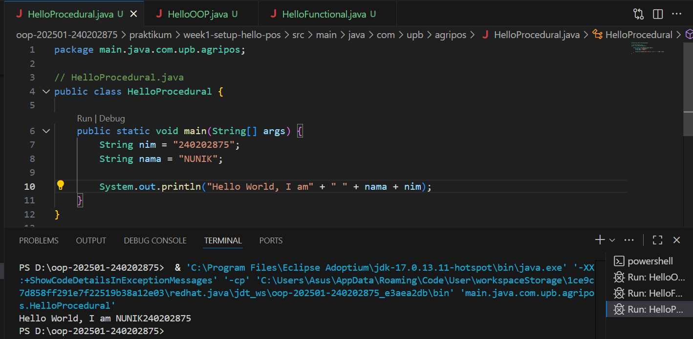
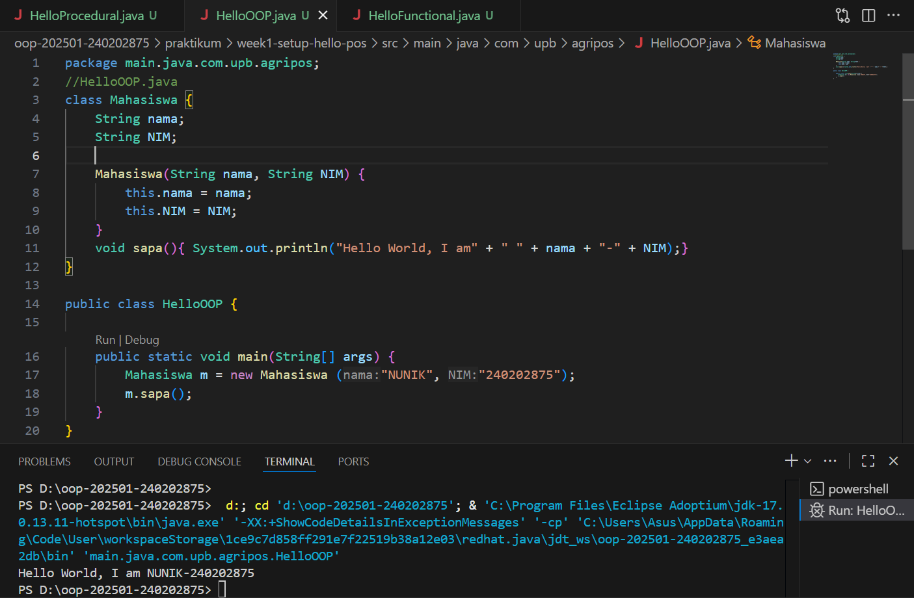
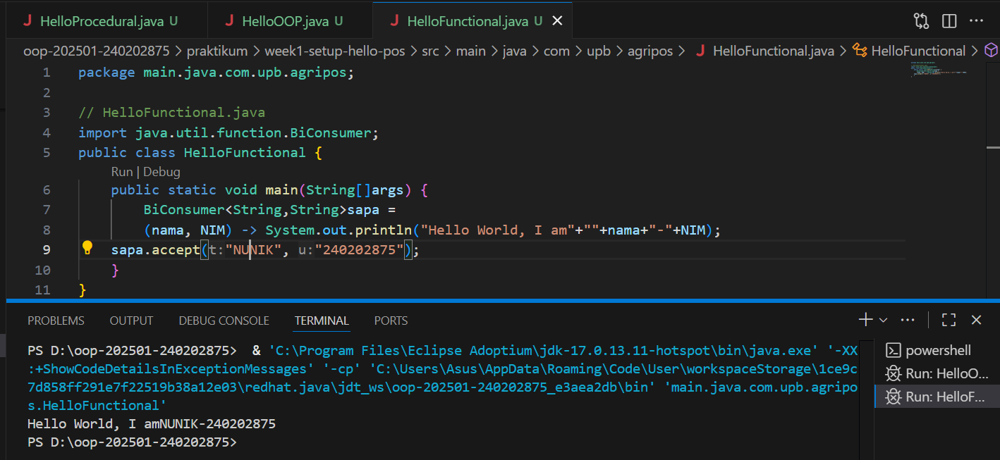

# Laporan Praktikum Minggu 1
Topik: Pengenalan Paradigma dan Setup Proyek

## Identitas
- Nama  : [Nunik Aulia Primadani]
- NIM   : [240202875]
- Kelas : [3IKRB]

---

## Tujuan
- Mahasiswa mampu mendefinisikan paradigma prosedural, OOP, dan fungsional.
- Mahasiswa mampu membandingkan kelebihan dan keterbatasan tiap paradigma.
- Mahasiswa mampu memberikan contoh program sederhana untuk masing-masing paradigma.
- Mahasiswa aktif dalam diskusi kelas (bertanya, menjawab, memberi opini).

---

## Dasar Teori
Paradigma pemrograman adalah cara pandang dalam menyusun program:

Prosedural: program dibangun sebagai rangkaian perintah (fungsi/prosedur).
OOP (Object-Oriented Programming): program dibangun dari objek yang memiliki data (atribut) dan perilaku (method).
Fungsional: program dipandang sebagai pemetaan fungsi matematika, lebih menekankan ekspresi dan transformasi data.
Dalam konteks Agri-POS, OOP membantu memodelkan entitas nyata seperti Produk, Transaksi, dan Pembayaran sebagai objek. Dengan demikian, sistem lebih mudah dikembangkan dan dipelihara.

---

## Langkah Praktikum
1. Setup Project

- Pastikan sudah menginstall JDK (Java Development Kit), IDE (misal: IntelliJ IDEA, VS Code, NetBeans), Git, PostgreSQL, dan JavaFX di komputer.
- Buat folder project oop-pos-<nim>.
- Inisialisasi repositori Git.
- Buat struktur awal src/main/java/com/upb/agripos/.
- Pastikan semua tools dapat berjalan (uji dengan membuat dan menjalankan program Java sederhana).

2. Program Sederhana dalam 3 Paradigma

Prosedural: program untuk menghitung total harga dua produk.
OOP: class Produk dengan atribut nama dan harga, buat minimal tiga objek, lalu hitung total.
Fungsional: gunakan Stream atau lambda untuk menghitung total harga dari minimal tiga objek.
Commit dan Push

3. Commit dengan pesan: week1-setup-hello-pos.


---

## Kode Program
1. Procedural

```java
//HelloProcuderal.java
public class HelloProcedural {

    public static void main(String[] args) {
        String nim = "240202875";
        String nama = "NUNIK";

        System.out.println("Hello World, I am" + " " + nama + "-" + nim);
    }
}
```

2. OOP

```java
//HelloOOP.java
class Mahasiswa {
    String nama;
    String NIM;
    Mahasiswa(String nama, String NIM) {
        this.nama = nama;
        this.NIM = NIM;
    }
    void sapa(){ System.out.println("Hello World, I am" + " " + nama + "-" + NIM);}
}

public class HelloOOP {
    
    public static void main(String[] args) {
        Mahasiswa m = new Mahasiswa ("NUNIK","240202875");
        m.sapa();
    }
}
```

3. Functional

```java
// HelloFunctional.java
import java.util.function.BiConsumer;
public class HelloFunctional {
    public static void main(String[]args) {
        BiConsumer<String,String>sapa =
        (nama, NIM) -> System.out.println("Hello World, I am"+""+nama+"-"+NIM);
    sapa.accept("NUNIK", "240202875");
    }
}
```

---

## Hasil Eksekusi 





---

## Analisis
(
- Jelaskan bagaimana kode berjalan.

1. Program Procedural (HelloProcedural.java)

Program dimulai dari method main().
Variabel nama dan nim dideklarasikan langsung di dalam main.
Kemudian program menjalankan perintah System.out.println() untuk menampilkan teks.
➜ Semua langkah dilakukan secara berurutan

2. Program OOP (HelloOOP.java)

Program mendefinisikan sebuah kelas Mahasiswa dengan atribut nama dan NIM, serta method sapa().
Di dalam main(), dibuat objek Mahasiswa bernama m dengan data "NUNIK" dan "240202875".
Lalu, objek m memanggil sapa() untuk menampilkan teks ke layar.
➜ Di sini, data dan perilaku disatukan dalam satu objek, bukan hanya deretan instruksi.

3. Program Functional (HelloFunctional.java)

Menggunakan interface fungsional BiConsumer untuk mendefinisikan fungsi lambda (nama, NIM) -> ....
Fungsi tersebut disimpan dalam variabel sapa, lalu dijalankan dengan sapa.accept("NUNIK", "240202875").
➜ Tidak menggunakan objek atau langkah prosedural panjang — cukup definisi fungsi dan pemanggilannya.

- Kendala yang dihadapi dan cara mengatasinya.  
Terjadi eror saat run program. Cara mengatasinya harusnya pada bagian Start Debugging bukan Run Code.

)

---

## Kesimpulan
setiap pendekatan memiliki cara berpikir dan struktur yang berbeda.
Dengan menggunakan class dan object (OOP), program menjadi lebih terstruktur, modular, dan mudah dikembangkan dibandingkan pendekatan prosedural yang bersifat langkah demi langkah.
Selain itu, pendekatan fungsional memperkenalkan konsep penggunaan fungsi sebagai komponen utama, sehingga kode menjadi lebih ringkas, efisien, dan mudah diuji.

---

## Quiz
1. Apakah OOP selalu lebih baik dari prosedural?  
   **Jawaban:** Tidak, OOP tidak selalu lebih baik dari prosedural. Pemilihan paradigma tergantung pada kebutuhan proyek; prosedural lebih sederhana untuk aplikasi kecil, sementara OOP lebih baik untuk yang kompleks dengan banyak interaksi data.

2. Kapan functional programming lebih cocok digunakan dibanding OOP atau prosedural?  
   **Jawaban:** Functional programming lebih cocok untuk aplikasi yang memerlukan komputasi paralel, pemrosesan data besar, atau di mana immutability penting, seperti di Big Data, machine learning, atau pengembangan web modern.

3. Bagaimana paradigma (prosedural, OOP, fungsional) memengaruhi maintainability dan scalability aplikasi?   
   **Jawaban:** Paradigma prosedural membuat kode mudah dimaintain untuk aplikasi kecil tapi sulit untuk yang besar; OOP meningkatkan maintainability melalui modularitas dan scalability melalui reuse; fungsional meningkatkan scalability dengan kode paralel dan maintainability dengan kurang efek samping.

4. Mengapa OOP lebih cocok untuk mengembangkan aplikasi POS dibanding prosedural?
   **Jawaban:** OOP lebih cocok untuk aplikasi POS karena dapat memodelkan entitas seperti produk dan transaksi sebagai objek, memungkinkan encapsulation dan reuse, sedangkan prosedural bisa menghasilkan kode yang berantakan.

5. Bagaimana paradigma fungsional dapat membantu mengurangi kode berulang (boilerplate code)?         
   **Jawaban:** Paradigma fungsional mengurangi kode berulang dengan menggunakan fungsi higher-order, lambdas, dan composition, yang memungkinkan kode yang lebih ringkas dan reusable.