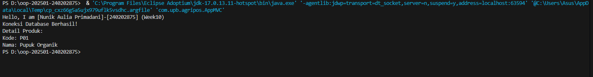
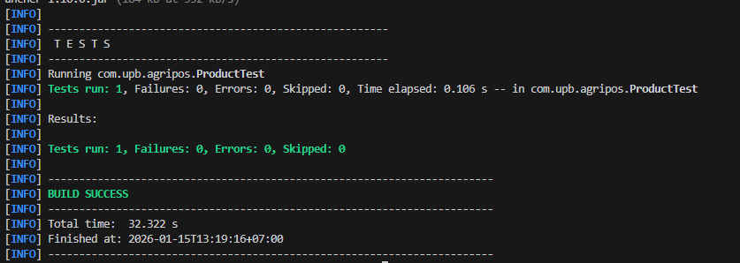

# Laporan Praktikum Minggu 10
Topik: [T"Design Pattern (Singleton, MVC) dan Unit Testing menggunakan JUnit"]

## Identitas
- Nama  : [NUNIK AULIA PRIMADANI]
- NIM   : [240202875]
- Kelas : [3IKRB]

---

## Tujuan
1. *Menjelaskan konsep dasar design pattern dalam rekayasa perangkat lunak.*
2. *Mengimplementasikan Singleton Pattern dengan benar.
Menjelaskan dan menerapkan Model–View–Controller (MVC) pada aplikasi sederhana.*
3. *Membuat dan menjalankan unit test menggunakan JUnit.*
4. *Menganalisis manfaat penerapan design pattern dan unit testing terhadap kualitas perangkat lunak.*

---

## Dasar Teori
### 1. Design Pattern  
Design pattern adalah solusi desain yang telah teruji untuk menyelesaikan masalah umum dalam pengembangan perangkat lunak. Fokus minggu ini:

- Singleton Pattern
- MVC (Model–View–Controller)

### 2. Singleton Pattern  
Tujuan: Menjamin suatu class hanya memiliki satu instance dan menyediakan titik akses global.

Karakteristik:

- Constructor private
- Atribut static instance
- Method static getInstance() Penerapan pada Agri-POS: koneksi database atau service global yang tidak boleh lebih dari satu instance.

### 3. MVC (Model–View–Controller)
memisahkan aplikasi menjadi tiga bagian agar kode lebih terstruktur dan mudah dipelihara.
Model berisi data dan logika bisnis, Vi

### 4. Model
berisi data dan logika bisnis, View menangani tampilan, dan Controller menjadi penghubung antara Model dan View.

### 5. Unit Testing
 menggunakan JUnit digunakan untuk menguji bagian kecil dari program secara terpisah.

---

## Langkah Praktikum
1. Membuat project Java berbasis Maven dengan struktur direktori yang sesuai.

2. Mengimplementasikan Singleton Pattern pada class DatabaseConnection.

3. Membuat struktur MVC sederhana yang terdiri dari:

- Model: Product
- View: ConsoleView
- Controller: ProductController
4. Membuat program utama AppMVC untuk mengintegrasikan seluruh komponen MVC.

5. Membuat unit test menggunakan JUnit pada class Product.

6. Menjalankan unit test menggunakan perintah mvn test.

7. Mendokumentasikan hasil pengujian dan melakukan commit dengan pesan:

week10-pattern-testing: implement singleton, mvc, and junit testing

---

## Kode Program
### 1.DatabaseConnection.java (Singleton)

```java
// Source code is decompiled from a .class file using FernFlower decompiler (from Intellij IDEA).
package com.upb.agripos.config;

import java.sql.Connection;
import java.sql.DriverManager;
import java.sql.SQLException;

public class DatabaseConnection {
   private static Connection connection;

   private DatabaseConnection() {
   }

   public static Connection getInstance() throws SQLException {
      if (connection == null || connection.isClosed()) {
         String url = "jdbc:postgresql://localhost:5432/agripos";
         String user = "postgres";
         String password = "242405";

         try {
            Class.forName("org.postgresql.Driver");
            connection = DriverManager.getConnection(url, user, password);
         } catch (ClassNotFoundException var4) {
            throw new SQLException("Driver PostgreSQL tidak ditemukan! Periksa pom.xml anda.", var4);
         }
      }

      return connection;
   }
}

```

### 2. Product.java (Model)

```java
// Source code is decompiled from a .class file using FernFlower decompiler (from Intellij IDEA).
package com.upb.agripos.model;

public class Product {
   private String code;
   private String name;

   public Product(String code, String name) {
      this.code = code;
      this.name = name;
   }

   public String getCode() {
      return this.code;
   }

   public String getName() {
      return this.name;
   }
}

```
### 3. ConsoleView.java (View)

```java
// Source code is decompiled from a .class file using FernFlower decompiler (from Intellij IDEA).
package com.upb.agripos.view;

public class ConsoleView {
   public ConsoleView() {
   }

   public void showMessage(String message) {
      System.out.println(message);
   }
}

```

### 4. ProductController.java (Controller)

```java
// Source code is decompiled from a .class file using FernFlower decompiler (from Intellij IDEA).
package com.upb.agripos.controller;

import com.upb.agripos.model.Product;
import com.upb.agripos.view.ConsoleView;

public class ProductController {
   private final Product model;
   private final ConsoleView view;

   public ProductController(Product model, ConsoleView view) {
      this.model = model;
      this.view = view;
   }

   public void showProduct() {
      this.view.showMessage("Detail Produk:");
      this.view.showMessage("Kode: " + this.model.getCode());
      this.view.showMessage("Nama: " + this.model.getName());
   }
}

```

### 5. AppMVC.java (Main Program)

```java
// Source code is decompiled from a .class file using FernFlower decompiler (from Intellij IDEA).
package com.upb.agripos;

import com.upb.agripos.config.DatabaseConnection;
import com.upb.agripos.controller.ProductController;
import com.upb.agripos.model.Product;
import com.upb.agripos.view.ConsoleView;
import java.sql.Connection;

public class AppMVC {
   public AppMVC() {
   }

   public static void main(String[] args) {
      System.out.println("Hello, I am [Nunik Aulia Primadani]-[240202875] (Week10)");

      try {
         Connection conn = DatabaseConnection.getInstance();
         if (conn != null) {
            System.out.println("Koneksi Database Berhasil!");
         }

         Product product = new Product("P01", "Pupuk Organik");
         ConsoleView view = new ConsoleView();
         ProductController controller = new ProductController(product, view);
         controller.showProduct();
      } catch (Exception var5) {
         System.err.println("Error: " + var5.getMessage());
      }

   }
}

```

### 6.  ProductTest.java (Unit Test JUnit)

```java
package com.upb.agripos;

import static org.junit.jupiter.api.Assertions.*;
import org.junit.jupiter.api.Test;
import com.upb.agripos.model.Product;

public class ProductTest {
    @Test
    public void testProductAttributes() {
        Product p = new Product("P01", "Benih Jagung");
        assertEquals("P01", p.getCode());
        assertEquals("Benih Jagung", p.getName());
    }
}
```
---

## Hasil Eksekusi

Berikut adalah hasil eksekusi program dan unit testing menggunakan JUnit:




Hasil menunjukkan bahwa program berjalan dengan baik dan unit test berhasil dijalankan tanpa error.

---

## Analisis

- Jelaskan bagaimana kode berjalan.  
   **Jawaban:** Program berjalan dengan menerapkan pemisahan tanggung jawab antara Model, View, dan Controller.
- Apa perbedaan pendekatan minggu ini dibanding minggu sebelumnya.  
    **Jawaban:** Dibandingkan minggu sebelumnya, pendekatan minggu ini lebih terstruktur karena menggunakan design pattern.
- Kendala yang dihadapi dan cara mengatasinya.  
    **Jawaban:** Kendala yang dihadapi adalah konfigurasi Maven dan JUnit, namun dapat diatasi dengan memastikan dependensi pada pom.xml sudah benar.

---

## Kesimpulan
*Berdasarkan praktikum yang telah dilakukan, dapat disimpulkan bahwa penerapan Singleton Pattern, MVC, dan Unit Testing mampu meningkatkan struktur, keterbacaan, dan kualitas perangkat lunak. Pengujian dengan JUnit membantu memastikan fungsi program berjalan sesuai dengan yang diharapkan.*

---

## Quiz
1. [Mengapa constructor pada Singleton harus bersifat private? ]  
   **Jawaban:**  Agar objek tidak dapat dibuat secara langsung dari luar class sehingga hanya satu instance yang digunakan.

2. [Jelaskan manfaat pemisahan Model, View, dan Controller.]  
   **Jawaban:** Memudahkan pengelolaan kode, meningkatkan keterbacaan, serta mempermudah pengembangan dan pemeliharaan aplikasi.

3. [Apa peran unit testing dalam menjaga kualitas perangkat lunak?]  
   **Jawaban:** Untuk memastikan setiap fungsi berjalan sesuai harapan dan mendeteksi kesalahan sejak dini.

4. [Apa risiko jika Singleton tidak diimplementasikan dengan benar? ]  
   **Jawaban:** Dapat menyebabkan lebih dari satu instance terbentuk sehingga mengakibatkan pemborosan resource dan inkonsistensi data.
