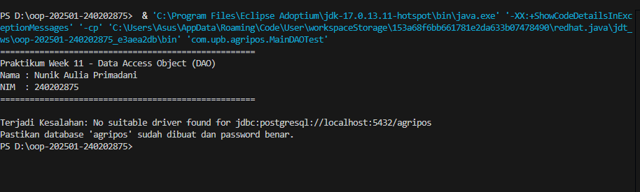

# Laporan Praktikum Minggu 11
Topik: ["Data Access Object (DAO) dan CRUD Database dengan JDBC"]

## Identitas
- Nama  : [NUNIK AULIA PRIMADANI]
- NIM   : [240202875]
- Kelas : [3IKRB]

---

## Tujuan
1. *Memahami konsep dan fungsi Data Access Object (DAO) dalam pemrograman berorientasi objek.*

2. *Menghubungkan aplikasi Java dengan database relasional menggunakan JDBC.*

3. *Menerapkan operasi CRUD (Create, Read, Update, Delete) secara lengkap.*

4. *Mengintegrasikan DAO ke dalam aplikasi Java dengan struktur kode yang rapi dan terpisah.*
---

## Dasar Teori
**1. Data Access Object (DAO)** merupakan design pattern yang berfungsi sebagai penghubung antara aplikasi dan database. DAO membantu memisahkan logika bisnis dengan proses akses data.
**2. JDBC (Java Database Connectivity)** adalah API standar Java untuk berkomunikasi dengan database seperti PostgreSQL.
**3. CRUD** adalah operasi dasar dalam pengelolaan data, meliputi penyimpanan data baru, pengambilan data, pembaruan data, dan penghapusan data.
**4. PreparedStatement** digunakan untuk meningkatkan keamanan dan performa eksekusi query SQL..
**5. Interface DAO** digunakan sebagai kontrak agar implementasi database dapat diganti tanpa mengubah kode utama aplikasi.

---

## Langkah Praktikum
1. Membuat project Java dengan nama `week11-dao-database.`

2. Membuat database PostgreSQL `agripos` beserta tabel `products.`

3. Menyusun class model `Product` sebagai representasi tabel.

4. Membuat interface `ProductDAO` yang berisi method CRUD.

5. Mengimplementasikan `ProductDAOImpl`.java dengan JDBC dan PreparedStatement.

6. Menguji seluruh operasi CRUD melalui class `MainDAOTest.`

7. Melakukan commit dan push ke repository Git dengan pesan yang sesuai.

8. Commit dan push dengan format:

`week11-dao-database: implement DAO pattern and CRUD operations with JDBC`

---

## Kode Program

## 1. Product.java (Model)

```java
package com.upb.agripos.model;

public class Product {
    private String code;
    private String name;
    private double price;
    private int stock;

    public Product(String code, String name, double price, int stock) {
        this.code = code;
        this.name = name;
        this.price = price;
        this.stock = stock;
    }

    // Getter
    public String getCode() { return code; }
    public String getName() { return name; }
    public double getPrice() { return price; }
    public int getStock() { return stock; }

    // Setter
    public void setName(String name) { this.name = name; }
    public void setPrice(double price) { this.price = price; }
    public void setStock(int stock) { this.stock = stock; }
}
```
### 2. ProductDAO.java

```java
package com.upb.agripos.dao;

import java.util.List;
import com.upb.agripos.model.Product;

public interface ProductDAO {
    void insert(Product product) throws Exception;
    Product findByCode(String code) throws Exception;
    List<Product> findAll() throws Exception;
    void update(Product product) throws Exception;
    void delete(String code) throws Exception;
}
```

### 3. ProductDAOImpl.java

```java
package com.upb.agripos.dao;

import java.sql.*;
import java.util.ArrayList;
import java.util.List;
import com.upb.agripos.model.Product;

public class ProductDAOImpl implements ProductDAO {
    private final Connection connection;

    public ProductDAOImpl(Connection connection) {
        this.connection = connection;
    }

    @Override
    public void insert(Product p) throws Exception {
        String sql = "INSERT INTO products(code, name, price, stock) VALUES (?, ?, ?, ?)";
        try (PreparedStatement ps = connection.prepareStatement(sql)) {
            ps.setString(1, p.getCode());
            ps.setString(2, p.getName());
            ps.setDouble(3, p.getPrice());
            ps.setInt(4, p.getStock());
            ps.executeUpdate();
        }
    }

    @Override
    public Product findByCode(String code) throws Exception {
        String sql = "SELECT * FROM products WHERE code = ?";
        try (PreparedStatement ps = connection.prepareStatement(sql)) {
            ps.setString(1, code);
            try (ResultSet rs = ps.executeQuery()) {
                if (rs.next()) {
                    return new Product(
                        rs.getString("code"),
                        rs.getString("name"),
                        rs.getDouble("price"),
                        rs.getInt("stock")
                    );
                }
            }
        }
        return null;
    }

    @Override
    public List<Product> findAll() throws Exception {
        List<Product> list = new ArrayList<>();
        String sql = "SELECT * FROM products";
        try (PreparedStatement ps = connection.prepareStatement(sql);
             ResultSet rs = ps.executeQuery()) {
            while (rs.next()) {
                list.add(new Product(
                    rs.getString("code"),
                    rs.getString("name"),
                    rs.getDouble("price"),
                    rs.getInt("stock")
                ));
            }
        }
        return list;
    }

    @Override
    public void update(Product p) throws Exception {
        String sql = "UPDATE products SET name=?, price=?, stock=? WHERE code=?";
        try (PreparedStatement ps = connection.prepareStatement(sql)) {
            ps.setString(1, p.getName());
            ps.setDouble(2, p.getPrice());
            ps.setInt(3, p.getStock());
            ps.setString(4, p.getCode());
            ps.executeUpdate();
        }
    }

    @Override
    public void delete(String code) throws Exception {
        String sql = "DELETE FROM products WHERE code=?";
        try (PreparedStatement ps = connection.prepareStatement(sql)) {
            ps.setString(1, code);
            ps.executeUpdate();
        }
    }
}
```

### 3. MainDAOTest

```java
package com.upb.agripos;

import java.sql.Connection;
import java.sql.DriverManager;
import java.util.List;
import com.upb.agripos.dao.ProductDAO;
import com.upb.agripos.dao.ProductDAOImpl;
import com.upb.agripos.model.Product;

public class MainDAOTest {
    public static void main(String[] args) {
        // Menampilkan Identitas sesuai permintaan Modul
        System.out.println("====================================================");
        System.out.println("Praktikum Week 11 - Data Access Object (DAO)");
        System.out.println("Nama : Nunik Aulia Primadani");
        System.out.println("NIM  : 240202875");
        System.out.println("====================================================");
        
        // Sesuaikan nama database 'agripos' dan password pgAdmin Anda
        String url = "jdbc:postgresql://localhost:5432/db_agripos";
        String user = "postgres";
        String pass = "MASUKKAN_PASSWORD_PGADMIN_DISINI"; 

        try (Connection conn = DriverManager.getConnection(url, user, pass)) {
            // Inisialisasi DAO
            ProductDAO dao = new ProductDAOImpl(conn);

            // --- 1. Operasi CREATE (Insert) ---
            System.out.println("\n[1] Menambah data produk baru...");
            Product newProduct = new Product("P01", "Pupuk Organik", 25000, 10);
            dao.insert(newProduct);
            System.out.println("Berhasil menambah: " + newProduct.getName());

            // --- 2. Operasi UPDATE ---
            System.out.println("\n[2] Mengupdate data produk P01...");
            Product updatedProduct = new Product("P01", "Pupuk Organik Premium", 30000, 8);
            dao.update(updatedProduct);
            System.out.println("Berhasil update ke: " + updatedProduct.getName());

            // --- 3. Operasi READ (Find by Code) ---
            System.out.println("\n[3] Mencari produk dengan kode P01...");
            Product p = dao.findByCode("P01");
            if (p != null) {
                System.out.println("Hasil Pencarian -> Nama: " + p.getName() + " | Harga: " + p.getPrice());
            }

            // --- 4. Operasi READ (Find All) ---
            System.out.println("\n[4] Daftar Semua Produk di Database:");
            List<Product> list = dao.findAll();
            for (Product item : list) {
                System.out.println(">> " + item.getCode() + " | " + item.getName() + " | Stok: " + item.getStock());
            }

            // --- 5. Operasi DELETE ---
            // Silakan uncomment baris di bawah ini jika ingin menguji fitur hapus
            // System.out.println("\n[5] Menghapus produk P01...");
            // dao.delete("P01");
            // System.out.println("Data berhasil dihapus.");

            System.out.println("\n====================================================");
            System.out.println("Status: Semua Operasi CRUD Berhasil Dijalankan.");

        } catch (Exception e) {
            System.err.println("\nTerjadi Kesalahan: " + e.getMessage());
            System.err.println("Pastikan database 'agripos' sudah dibuat dan password benar.");
        }
    }
}
```
---

## Hasil Eksekusi
  


---

## Analisis

- Jelaskan bagaimana kode berjalan.  
   **Jawaban:** Program dijalankan melalui kelas MainDAOTest yang berfungsi sebagai titik awal eksekusi. Pertama, program memuat driver JDBC PostgreSQL, kemudian melakukan koneksi ke database menggunakan DriverManager. Setelah koneksi berhasil, objek ProductDAOImpl dibuat dan digunakan untuk menjalankan operasi CRUD (Create, Read, Update, Delete) terhadap tabel products. Setiap operasi database diakses melalui method DAO sehingga logika akses data terpisah dari logika aplikasi utama.
- Apa perbedaan pendekatan minggu ini dibanding minggu sebelumnya.  
   **Jawaban:** Pada minggu sebelumnya, pengolahan data masih dilakukan secara langsung di dalam program tanpa melibatkan database dan tanpa lapisan khusus. Pada minggu ini, digunakan pendekatan DAO (Data Access Object) yang memisahkan logika akses data ke dalam class tersendiri serta memanfaatkan database PostgreSQL sebagai penyimpanan data. Pendekatan ini membuat kode lebih terstruktur, modular, dan mudah dikembangkan.
- Kendala yang dihadapi dan cara mengatasinya.  
   **Jawaban:** Kendala utama yang dihadapi adalah error koneksi database seperti “No suitable driver found” dan kesalahan konfigurasi pom.xml. Masalah ini diatasi dengan menambahkan dependency JDBC PostgreSQL ke dalam pom.xml, memperbaiki struktur Maven, serta menjalankan program menggunakan Maven agar seluruh dependency dapat dimuat dengan benar. Selain itu, proses reload Maven juga dilakukan agar perubahan konfigurasi dapat diterapkan.

---

## Kesimpulan
*Penerapan Data Access Object (DAO) dan JDBC memungkinkan aplikasi Java terhubung dengan database secara terstruktur. Operasi CRUD dapat dijalankan dengan baik dan kode program menjadi lebih rapi, modular, serta mudah dikembangkan.*

---

## Quiz
1. [Apa fungsi utama Data Access Object (DAO)?]  
   **Jawaban:** Memisahkan logika akses data dari logika bisnis aplikasi.

2. [Mengapa PreparedStatement lebih aman digunakan dibanding Statement?]  
   **Jawaban:** Karena mencegah SQL Injection dan meningkatkan efisiensi eksekusi query.

3. [Sebutkan operasi yang termasuk dalam CRUD!]  
   **Jawaban:** Create, Read, Update, dan Delete.
