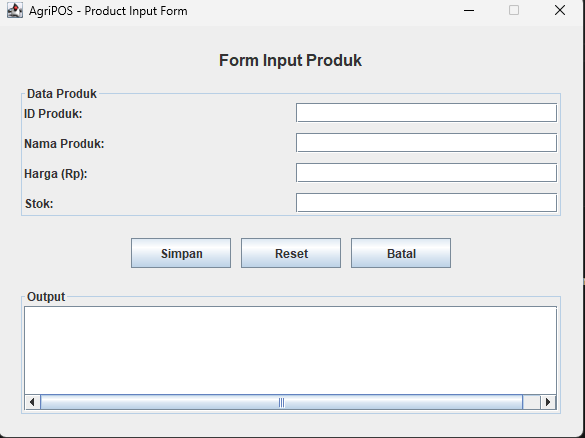
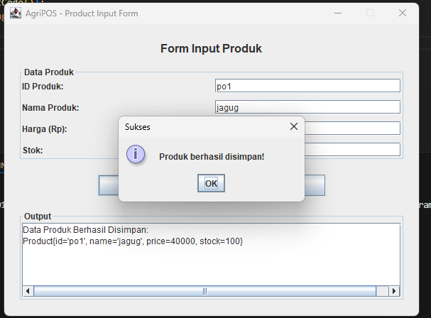

# Laporan Praktikum Minggu 12 - "GUI Dasar JavaFX (Event-Driven Programming)"

Topik: "GUI Dasar JavaFX (Event-Driven Programming)"

## Identitas
- Nama  : [Nunik Aulia Primadani]
- NIM   : [240202875]
- Kelas : [3IKRB]

---

## Tujuan

Tujuan dari praktikum ini adalah agar mahasiswa mampu memahami konsep event-driven programming serta membangun antarmuka grafis sederhana menggunakan JavaFX. Selain itu, mahasiswa diharapkan dapat mengintegrasikan GUI dengan backend aplikasi menggunakan konsep MVC, Service, dan DAO tanpa menuliskan ulang logika CRUD pada layer tampilan.

---

## Dasar Teori

1. JavaFX JavaFX adalah platform untuk membuat aplikasi desktop dengan GUI modern. JavaFX menyediakan komponen UI yang kaya seperti Button, TextField, TableView, dan mendukung styling dengan CSS. Komponen Utama:

Stage: Window utama aplikasi Scene: Container untuk elemen UI Node: Elemen UI individual (Button, Label, TextField) Layout Panes: Container untuk mengatur tata letak (VBox, HBox, GridPane)

2. Event-Driven Programming Event-Driven Programming adalah paradigma pemrograman di mana alur program ditentukan oleh event (kejadian) seperti klik mouse, input keyboard, atau aksi pengguna lainnya. Program tidak berjalan secara linear, melainkan menunggu event terjadi dan merespons dengan menjalankan event handler yang telah didefinisikan.
Karakteristik: Alur program bersifat reaktif, bukan sequential Menggunakan callback atau handler untuk merespons event Cocok untuk aplikasi yang membutuhkan interaksi user tinggi

3. Pola desain MVC (Model-View-Controller) digunakan untuk memisahkan logika bisnis, tampilan, dan pengendali aplikasi.
4. Data Access Object (DAO) berfungsi untuk memisahkan akses database dari logika bisnis aplikasi.
5. Service layer berperan sebagai penghubung antara controller dan DAO sesuai prinsip SOLID (Dependency Inversion Principle).

---

## Langkah Praktikum

1. Menyiapkan project Maven dengan dependency JavaFX dan PostgreSQL.
2. Menyesuaikan versi Java compiler ke Java 17 agar kompatibel dengan runtime.
3. Membuat class Product sebagai model data produk.
4. Mengimplementasikan ProductDAO untuk operasi database.
5. Membuat ProductService sebagai layer bisnis.
6. Membuat GUI JavaFX berupa form input produk dan area tampilan data.
7. Menambahkan event handler pada tombol “Tambah Produk”.
8. Menghubungkan event GUI dengan ProductController dan ProductService.
9. Menjalankan aplikasi menggunakan perintah mvn javafx:run.
10. Melakukan commit

---

## Kode Program

### ProductController.java

```java
package com.upb.agripos.controller;

import com.upb.agripos.model.Product; 
import com.upb.agripos.service.ProductService;
import com.upb.agripos.view.ProductFormView;
import javafx.collections.FXCollections;
import javafx.collections.ObservableList;

public class ProductController {
    private ProductService service;
    private ProductFormView view;

    public ProductController(ProductService service, ProductFormView view) {
        this.service = service;
        this.view = view;
        initController();
    }

    private void initController() {
        loadData(); // Memasukkan data ke list saat aplikasi dibuka

        // Memberi aksi pada tombol Tambah Produk
        view.btnTambah.setOnAction(e -> {
            try {
                // 1. Ambil data dari kotak input (TextField)
                String code = view.txtKode.getText();
                String name = view.txtNama.getText();
                double price = Double.parseDouble(view.txtHarga.getText());
                int stock = Integer.parseInt(view.txtStok.getText());

                // 2. Buat objek Product (Sesuai dengan constructor Product.java kamu)
                Product newProduct = new Product(code, name, price, stock);
                
                // 3. Simpan lewat Service
                service.addProduct(newProduct);
                
                // 4. Refresh tampilan dan kosongkan inputan
                loadData();
                clearFields();
                System.out.println("Data berhasil disimpan!");

            } catch (NumberFormatException ex) {
                System.err.println("Harga dan Stok harus angka!");
            } catch (Exception ex) {
                System.err.println("Gagal simpan: " + ex.getMessage());
            }
        });
    }

    private void loadData() {
        try {
            ObservableList<String> displayList = FXCollections.observableArrayList();
            // Gunakan getName() dan getStock() sesuai file Product.java kamu
            for (Product p : service.getAllProducts()) {
                displayList.add(p.getCode() + " - " + p.getName() + " (Stok: " + p.getStock() + ")");
            }
            view.listProduk.setItems(displayList);
        } catch (Exception e) {
            System.err.println("Gagal load data: " + e.getMessage());
        }
    }

    private void clearFields() {
        view.txtKode.clear();
        view.txtNama.clear();
        view.txtHarga.clear();
        view.txtStok.clear();
    }
}

```

### ProductDAO.java

```java
package com.upb.agripos.dao;

import com.upb.agripos.model.Product;
import java.util.List;

public interface ProductDAO {
    
    void insert(Product product) throws Exception;
    Product findByCode(String code) throws Exception;
    List<Product> findAll() throws Exception;
    void update(Product product) throws Exception;
    void delete(String code) throws Exception;
}

```

### ProductDAOImpl.java

```java
package com.upb.agripos.dao;

import java.sql.Connection;
import java.sql.PreparedStatement;
import java.sql.ResultSet;
import java.sql.SQLException;
import java.sql.Statement;
import java.util.ArrayList;
import java.util.List;

import com.upb.agripos.model.Product;

public class ProductDAOImpl implements ProductDAO {
    private Connection connection;

    public ProductDAOImpl(Connection connection) {
        this.connection = connection;
    }

    @Override
    public void insert(Product p) {
        String sql = "INSERT INTO products (code, name, price, stock) VALUES (?, ?, ?, ?)";
        try (PreparedStatement stmt = connection.prepareStatement(sql)) {
            stmt.setString(1, p.getCode());
            stmt.setString(2, p.getName());
            stmt.setDouble(3, p.getPrice());
            stmt.setInt(4, p.getStock());
            stmt.executeUpdate();
        } catch (SQLException e) {
            e.printStackTrace();
        }
    }

    @Override
    public void update(Product p) {
        String sql = "UPDATE products SET name = ?, price = ?, stock = ? WHERE code = ?";
        try (PreparedStatement stmt = connection.prepareStatement(sql)) {
            stmt.setString(1, p.getName());
            stmt.setDouble(2, p.getPrice());
            stmt.setInt(3, p.getStock());
            stmt.setString(4, p.getCode());
            stmt.executeUpdate();
        } catch (SQLException e) {
            e.printStackTrace();
        }
    }

    @Override
    public void delete(String code) {
        String sql = "DELETE FROM products WHERE code = ?";
        try (PreparedStatement stmt = connection.prepareStatement(sql)) {
            stmt.setString(1, code);
            stmt.executeUpdate();
        } catch (SQLException e) {
            e.printStackTrace();
        }
    }

    @Override
    public Product findByCode(String code) {
        String sql = "SELECT * FROM products WHERE code = ?";
        try (PreparedStatement stmt = connection.prepareStatement(sql)) {
            stmt.setString(1, code);
            try (ResultSet rs = stmt.executeQuery()) {
                if (rs.next()) {
                    return new Product(
                        rs.getString("code"),
                        rs.getString("name"),
                        rs.getDouble("price"),
                        rs.getInt("stock")
                    );
                }
            }
        } catch (SQLException e) {
            e.printStackTrace();
        }
        return null;
    }

    @Override
    public List<Product> findAll() {
        List<Product> list = new ArrayList<>();
        String sql = "SELECT * FROM products";
        try (Statement stmt = connection.createStatement();
             ResultSet rs = stmt.executeQuery(sql)) {
            while (rs.next()) {
                list.add(new Product(
                    rs.getString("code"),
                    rs.getString("name"),
                    rs.getDouble("price"),
                    rs.getInt("stock")
                ));
            }
        } catch (SQLException e) {
            e.printStackTrace();
        }
        return list;
    }
}
```

### Product.java

```java
package com.upb.agripos.model;

public class Product {
    private String code;
    private String name;
    private double price;
    private int stock;

    public Product(String code, String name, double price, int stock) {
        this.code = code;
        this.name = name;
        this.price = price;
        this.stock = stock;
    }

    public String getCode() {
        return code;
    }

    public void setCode(String code) {
        this.code = code;
    }

    public String getName() {
        return name;
    }

    public void setName(String name) {
        this.name = name;
    }

    public double getPrice() {
        return price;
    }

    public void setPrice(double price) {
        this.price = price;
    }

    public int getStock() {
        return stock;
    }

    public void setStock(int stock) {
        this.stock = stock;
    }
}

```

### ProductService.java
```java
package com.upb.agripos.service;

import java.util.List;

import com.upb.agripos.dao.ProductDAO;
import com.upb.agripos.model.Product;

public class ProductService {
    private final ProductDAO productDAO;

    public ProductService(ProductDAO productDAO) {
        this.productDAO = productDAO;
    }

    public void addProduct(Product product) {
        // Di sini bisa ditambahkan validasi bisnis jika perlu
        productDAO.insert(product);
    }

    public List<Product> getAllProducts() {
        return productDAO.findAll();
    }
}

```
### AppJavaFX.java
```java
package com.upb.agripos;

import com.upb.agripos.view.ProductFormView;
import com.upb.agripos.controller.ProductController;
import com.upb.agripos.dao.*;
import com.upb.agripos.service.ProductService;
import javafx.application.Application;
import javafx.scene.Scene;
import javafx.stage.Stage;
import java.sql.Connection;
import java.sql.DriverManager;

public class AppJavaFX extends Application {

    @Override
    public void start(Stage stage) {
        // 1. Tampilkan Jendela Dulu
        ProductFormView view = new ProductFormView();
        Scene scene = new Scene(view, 400, 550);
        stage.setTitle("Agri-POS - Week 12");
        stage.setScene(scene);
        stage.show();

        // 2. Coba Hubungkan Database (Gunakan try-catch agar jika gagal, app tidak mati)
        try {
            // GANTI PASSWORD SESUAI LAPTOP KAMU
            Connection conn = DriverManager.getConnection(
                "jdbc:postgresql://localhost:5432/agripos", "postgres", "1234"
            );

            // Inisialisasi MVC
            ProductDAO dao = new ProductDAOImpl(conn);
            ProductService service = new ProductService(dao);
            new ProductController(service, view);

            System.out.println("Koneksi Database Berhasil!");
        } catch (Exception e) {
            System.err.println("Database Error (Aplikasi tetap jalan): " + e.getMessage());
        }
    }

    public static void main(String[] args) {
        launch(args);
    }
}
```
---

## Hasil Eksekusi

#### 1.Input Data Produk


#### 2.Hasil Suksess


---

## Analisis

Pada praktikum ini, aplikasi berjalan menggunakan konsep event-driven programming, di mana aksi pengguna pada tombol akan memicu proses penambahan data produk. Dibandingkan praktikum sebelumnya yang berbasis console, praktikum ini menampilkan output secara visual melalui GUI. Kendala yang dihadapi adalah ketidaksesuaian versi Java compiler dengan runtime, yang menyebabkan error UnsupportedClassVersionError. Masalah tersebut diatasi dengan menyamakan versi compiler ke Java 17 pada file pom.xml.

---

## Traceability Bab 6 (UML) -> Implementasi GUI

| Artefak Bab 6 | Referensi | Handler GUI (View) | Controller & Service | Data Access Object (DAO) | Dampak pada UI & Database |
| :--- | :--- | :--- | :--- | :--- | :--- |
| **Use Case** | UC-01 Tambah Produk | Tombol `btnTambah` | `ProductController.handleAddProduct()` memanggil `service.addProduct(p)` | `ProductDAO.insert(product)` | Baris data baru tersimpan di tabel produk dan muncul di ListView |
| **Activity Diagram** | AD-01 Alur Input Produk | `TextField` (txtKode, txtNama, dll) | Validasi data menggunakan `Double.parseDouble` & `Integer.parseInt` | `productDAO.insert()` dipicu setelah validasi sukses | Mencegah aplikasi crash jika user salah memasukkan format harga/stok |
| **Sequence Diagram** | SD-01 Interaksi Simpan | `setOnAction(e -> ...)` pada tombol | Alur data sekuensial: View mengirim data -> Controller membungkus Model -> Service memproses | `DAO` mengeksekusi Query SQL `INSERT INTO...` menggunakan JDBC | Menjamin data berpindah dari layar (GUI) ke penyimpanan permanen (DB) secara urut |
| **Class Diagram** | Struktur MVC & SOLID | Komponen `VBox` & `ListView` | `ProductController` menghubungkan View dengan `ProductService` | `ProductDAOImpl` mengimplementasikan interface DAO | Terciptanya pemisahan logika (Decoupling) sehingga kode mudah dikembangkan |

---
## Kesimpulan

Berdasarkan praktikum ini, dapat disimpulkan bahwa penggunaan JavaFX memungkinkan pembuatan antarmuka grafis yang interaktif dan mudah digunakan. Dengan menerapkan konsep MVC, Service, dan DAO, struktur aplikasi menjadi lebih terorganisir serta sesuai dengan prinsip desain perangkat lunak yang baik.

---
