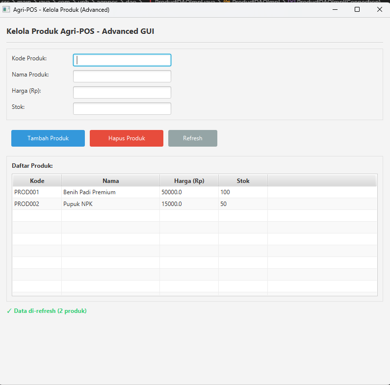

# Laporan Praktikum Minggu 13 - GUI Lanjutan JavaFX (TableView dan Lambda Expression)

## Identitas
- Nama  : [Nunik Aulia Primadani]
- NIM   : [240202875]
- Kelas : [3IKRB]

---

## Tujuan

1. Menampilkan data menggunakan TableView JavaFX.
2. Mengintegrasikan koleksi objek dengan GUI.
3. Menggunakan lambda expression untuk event handling.
4. Menghubungkan GUI dengan DAO secara penuh.
5. Membangun antarmuka GUI Agri-POS yang lebih interaktif.

---

## Dasar Teori

1. TableView JavaFX digunakan untuk menampilkan data dalam bentuk tabel yang terstruktur dan dinamis.
2. Lambda Expression menyederhanakan penulisan event handler pada JavaFX.
3. DAO (Data Access Object) memisahkan logika akses data dari logika aplikasi.
4. Service Layer menjadi penghubung antara controller dan DAO.
5. Prinsip SOLID (DIP) memastikan View tidak berinteraksi langsung dengan database.

---

## Langkah Praktikum

1. Persiapan Project Menyusun dan mengonfigurasi file pom.xml untuk kebutuhan JavaFX dan koneksi database PostgreSQL.

2. Pengembangan Backend Mengimplementasikan kelas ProductDAO, ProductDAOImpl, dan ProductService sebagai pengelola akses data.

3. Pembuatan Antarmuka (View) Merancang ProductTableView yang berisi tabel daftar produk serta tombol aksi.

4. Implementasi Controller Mengembangkan ProductController sebagai penghubung antara View dan Service, serta menangani aksi pengguna menggunakan lambda expression.

5. Integrasi Aplikasi Menggabungkan seluruh komponen aplikasi melalui kelas AppJavaFX.

6. Melakukan commit dengan pesan

## Kode Program

### ProductController.java
```java
package com.upb.agripos.controller;

import com.upb.agripos.model.Product;
import com.upb.agripos.service.ProductService;

/**
 * Controller untuk menangani logic aplikasi
 * Menghubungkan View dan Service layer
 * Menerapkan prinsip Single Responsibility Principle (SRP)
 */
public class ProductController {
    private final ProductService productService;

    /**
     * Constructor dengan dependency injection
     * @param productService Service untuk Product
     */
    public ProductController(ProductService productService) {
        this.productService = productService;
    }

    /**
     * Menambah produk baru
     * Dipanggil dari View ketika tombol "Tambah" diklik
     * 
     * @param code Kode produk
     * @param name Nama produk
     * @param price Harga produk
     * @param stock Stok produk
     * @return true jika berhasil, false jika gagal
     */
    public boolean addProduct(String code, String name, String price, String stock) {
        try {
            // Validasi tidak boleh kosong
            if (code == null || code.trim().isEmpty() ||
                name == null || name.trim().isEmpty() ||
                price == null || price.trim().isEmpty() ||
                stock == null || stock.trim().isEmpty()) {
                return false;
            }

            // Parse numeric fields
            double priceValue = Double.parseDouble(price);
            int stockValue = Integer.parseInt(stock);

            // Buat object Product
            Product product = new Product(code, name, priceValue, stockValue);

            // Panggil service untuk insert
            productService.insert(product);
            return true;
        } catch (NumberFormatException e) {
            System.err.println("Error parsing number: " + e.getMessage());
            return false;
        } catch (IllegalArgumentException e) {
            System.err.println("Validation error: " + e.getMessage());
            return false;
        } catch (Exception e) {
            System.err.println("Database error: " + e.getMessage());
            return false;
        }
    }

    /**
     * Mengambil semua data produk
     * Dipanggil saat aplikasi dimulai atau refresh
     * 
     * @return List berisi semua produk
     */
    public java.util.List<Product> getAllProducts() {
        try {
            return productService.findAll();
        } catch (Exception e) {
            System.err.println("Error fetching products: " + e.getMessage());
            return new java.util.ArrayList<>();
        }
    }

    /**
     * Mencari produk berdasarkan kode
     * @param code Kode produk
     * @return Product jika ditemukan, null jika tidak
     */
    public Product findByCode(String code) {
        try {
            return productService.findByCode(code);
        } catch (Exception e) {
            System.err.println("Error finding product: " + e.getMessage());
            return null;
        }
    }

    /**
     * Update data produk
     * @param code Kode produk
     * @param name Nama produk baru
     * @param price Harga baru
     * @param stock Stok baru
     * @return true jika berhasil, false jika gagal
     */
    public boolean updateProduct(String code, String name, String price, String stock) {
        try {
            if (code == null || code.trim().isEmpty() ||
                name == null || name.trim().isEmpty() ||
                price == null || price.trim().isEmpty() ||
                stock == null || stock.trim().isEmpty()) {
                return false;
            }

            double priceValue = Double.parseDouble(price);
            int stockValue = Integer.parseInt(stock);

            Product product = new Product(code, name, priceValue, stockValue);
            productService.update(product);
            return true;
        } catch (Exception e) {
            System.err.println("Error updating product: " + e.getMessage());
            return false;
        }
    }

    /**
     * Menghapus produk
     * @param code Kode produk yang akan dihapus
     * @return true jika berhasil, false jika gagal
     */
    public boolean deleteProduct(String code) {
        try {
            if (code == null || code.trim().isEmpty()) {
                return false;
            }
            productService.delete(code);
            return true;
        } catch (Exception e) {
            System.err.println("Error deleting product: " + e.getMessage());
            return false;
        }
    }
}

```

### ProductDAO.java
```java
package com.upb.agripos.dao;

import com.upb.agripos.model.Product;
import java.sql.SQLException;
import java.util.List;

public interface ProductDAO {
    void insert(Product p) throws SQLException;
    Product findByCode(String code) throws SQLException;
    List<Product> findAll() throws SQLException;
    void update(Product p) throws SQLException;
    void delete(String code) throws SQLException;
}

```

### ProductDAOlmpl.java
```java
package com.upb.agripos.dao;

import com.upb.agripos.model.Product;

import java.sql.*;
import java.util.ArrayList;
import java.util.List;

public class ProductDAOImpl implements ProductDAO {

    private final Connection connection;

    public ProductDAOImpl(Connection connection) {
        if (connection == null) throw new IllegalArgumentException("Connection tidak boleh null");
        this.connection = connection;
    }

    @Override
    public void insert(Product p) throws SQLException {
        if (p == null) throw new IllegalArgumentException("Product tidak boleh null");

        String sql = "INSERT INTO products (code, name, price, stock) VALUES (?, ?, ?, ?)";
        try (PreparedStatement ps = connection.prepareStatement(sql)) {
            ps.setString(1, p.getCode());
            ps.setString(2, p.getName());
            ps.setDouble(3, p.getPrice());
            ps.setInt(4, p.getStock());
            ps.executeUpdate();
        }
    }

    @Override
    public Product findByCode(String code) throws SQLException {
        if (code == null) throw new IllegalArgumentException("Code tidak boleh null");

        String sql = "SELECT code, name, price, stock FROM products WHERE code = ?";
        try (PreparedStatement ps = connection.prepareStatement(sql)) {
            ps.setString(1, code);
            try (ResultSet rs = ps.executeQuery()) {
                if (rs.next()) {
                    return new Product(
                        rs.getString("code"),
                        rs.getString("name"),
                        rs.getDouble("price"),
                        rs.getInt("stock")
                    );
                }
            }
        }
        return null;
    }

    @Override
    public List<Product> findAll() throws SQLException {
        List<Product> list = new ArrayList<>();
        String sql = "SELECT code, name, price, stock FROM products";

        try (PreparedStatement ps = connection.prepareStatement(sql);
             ResultSet rs = ps.executeQuery()) {

            while (rs.next()) {
                Product p = new Product(
                    rs.getString("code"),
                    rs.getString("name"),
                    rs.getDouble("price"),
                    rs.getInt("stock")
                );
                list.add(p);
            }
        }
        return list;
    }

    @Override
    public void update(Product p) throws SQLException {
        if (p == null) throw new IllegalArgumentException("Product tidak boleh null");

        String sql = "UPDATE products SET name = ?, price = ?, stock = ? WHERE code = ?";
        try (PreparedStatement ps = connection.prepareStatement(sql)) {
            ps.setString(1, p.getName());
            ps.setDouble(2, p.getPrice());
            ps.setInt(3, p.getStock());
            ps.setString(4, p.getCode());

            int rows = ps.executeUpdate();
            if (rows == 0) {
                throw new SQLException("Update gagal, produk dengan code " + p.getCode() + " tidak ditemukan.");
            }
        }
    }

    @Override
    public void delete(String code) throws SQLException {
        if (code == null) throw new IllegalArgumentException("Code tidak boleh null");

        String sql = "DELETE FROM products WHERE code = ?";
        try (PreparedStatement ps = connection.prepareStatement(sql)) {
            ps.setString(1, code);

            int rows = ps.executeUpdate();
            if (rows == 0) {
                throw new SQLException("Delete gagal, produk dengan code " + code + " tidak ditemukan.");
            }
        }
    }
}

```

### Product.java
```java
package com.upb.agripos.model;

public class Product {
    private String code;
    private String name;
    private double price;
    private int stock;

    public Product(String code, String name, double price, int stock) {
        this.code = code;
        this.name = name;
        this.price = price;
        this.stock = stock;
    }

    public String getCode() { return code; }
    public String getName() { return name; }
    public double getPrice() { return price; }
    public int getStock() { return stock; }

    public void setName(String name) { this.name = name; }
    public void setPrice(double price) { this.price = price; }
    public void setStock(int stock) { this.stock = stock; }
}
```

### ProductService.java
```java
package com.upb.agripos.service;

import com.upb.agripos.model.Product;
import com.upb.agripos.dao.ProductDAOImpl;
import java.util.List;

/**
 * Service Layer untuk Product
 * Menangani business logic dan validasi
 * Berfungsi sebagai intermediary antara View/Controller dengan DAO
 * Implementasi dari Dependency Inversion Principle (DIP)
 */
public class ProductService {
    private final ProductDAOImpl productDAO;

    /**
     * Constructor dengan dependency injection
     * @param productDAO Data Access Object untuk Product
     */
    public ProductService(ProductDAOImpl productDAO) {
        this.productDAO = productDAO;
    }

    /**
     * Menambah produk baru dengan validasi
     * @param product Produk yang akan ditambahkan
     * @throws Exception jika ada error di database atau validasi
     */
    public void insert(Product product) throws Exception {
        // Validasi input
        if (product.getCode() == null || product.getCode().trim().isEmpty()) {
            throw new IllegalArgumentException("Kode produk tidak boleh kosong");
        }
        if (product.getName() == null || product.getName().trim().isEmpty()) {
            throw new IllegalArgumentException("Nama produk tidak boleh kosong");
        }
        if (product.getPrice() <= 0) {
            throw new IllegalArgumentException("Harga harus lebih dari 0");
        }
        if (product.getStock() < 0) {
            throw new IllegalArgumentException("Stok tidak boleh negatif");
        }

        // Panggil DAO untuk insert
        productDAO.insert(product);
    }

    /**
     * Mencari produk berdasarkan kode
     * @param code Kode produk
     * @return Product jika ditemukan, null jika tidak
     * @throws Exception jika ada error di database
     */
    public Product findByCode(String code) throws Exception {
        if (code == null || code.trim().isEmpty()) {
            throw new IllegalArgumentException("Kode produk tidak boleh kosong");
        }
        return productDAO.findByCode(code);
    }

    /**
     * Mengambil semua data produk
     * @return List berisi semua produk
     * @throws Exception jika ada error di database
     */
    public List<Product> findAll() throws Exception {
        return productDAO.findAll();
    }

    /**
     * Update data produk yang sudah ada
     * @param product Produk dengan data terbaru
     * @throws Exception jika ada error di database atau validasi
     */
    public void update(Product product) throws Exception {
        // Validasi input
        if (product.getCode() == null || product.getCode().trim().isEmpty()) {
            throw new IllegalArgumentException("Kode produk tidak boleh kosong");
        }
        if (product.getName() == null || product.getName().trim().isEmpty()) {
            throw new IllegalArgumentException("Nama produk tidak boleh kosong");
        }
        if (product.getPrice() <= 0) {
            throw new IllegalArgumentException("Harga harus lebih dari 0");
        }
        if (product.getStock() < 0) {
            throw new IllegalArgumentException("Stok tidak boleh negatif");
        }

        productDAO.update(product);
    }

    /**
     * Menghapus produk berdasarkan kode
     * @param code Kode produk yang akan dihapus
     * @throws Exception jika ada error di database
     */
    public void delete(String code) throws Exception {
        if (code == null || code.trim().isEmpty()) {
            throw new IllegalArgumentException("Kode produk tidak boleh kosong");
        }
        productDAO.delete(code);
    }
}
```

### AppJavaFX.java
```java
package com.upb.agripos.service;

import com.upb.agripos.model.Product;
import com.upb.agripos.dao.ProductDAOImpl;
import java.util.List;

/**
 * Service Layer untuk Product
 * Menangani business logic dan validasi
 * Berfungsi sebagai intermediary antara View/Controller dengan DAO
 * Implementasi dari Dependency Inversion Principle (DIP)
 */
public class ProductService {
    private final ProductDAOImpl productDAO;

    /**
     * Constructor dengan dependency injection
     * @param productDAO Data Access Object untuk Product
     */
    public ProductService(ProductDAOImpl productDAO) {
        this.productDAO = productDAO;
    }

    /**
     * Menambah produk baru dengan validasi
     * @param product Produk yang akan ditambahkan
     * @throws Exception jika ada error di database atau validasi
     */
    public void insert(Product product) throws Exception {
        // Validasi input
        if (product.getCode() == null || product.getCode().trim().isEmpty()) {
            throw new IllegalArgumentException("Kode produk tidak boleh kosong");
        }
        if (product.getName() == null || product.getName().trim().isEmpty()) {
            throw new IllegalArgumentException("Nama produk tidak boleh kosong");
        }
        if (product.getPrice() <= 0) {
            throw new IllegalArgumentException("Harga harus lebih dari 0");
        }
        if (product.getStock() < 0) {
            throw new IllegalArgumentException("Stok tidak boleh negatif");
        }

        // Panggil DAO untuk insert
        productDAO.insert(product);
    }

    /**
     * Mencari produk berdasarkan kode
     * @param code Kode produk
     * @return Product jika ditemukan, null jika tidak
     * @throws Exception jika ada error di database
     */
    public Product findByCode(String code) throws Exception {
        if (code == null || code.trim().isEmpty()) {
            throw new IllegalArgumentException("Kode produk tidak boleh kosong");
        }
        return productDAO.findByCode(code);
    }

    /**
     * Mengambil semua data produk
     * @return List berisi semua produk
     * @throws Exception jika ada error di database
     */
    public List<Product> findAll() throws Exception {
        return productDAO.findAll();
    }

    /**
     * Update data produk yang sudah ada
     * @param product Produk dengan data terbaru
     * @throws Exception jika ada error di database atau validasi
     */
    public void update(Product product) throws Exception {
        // Validasi input
        if (product.getCode() == null || product.getCode().trim().isEmpty()) {
            throw new IllegalArgumentException("Kode produk tidak boleh kosong");
        }
        if (product.getName() == null || product.getName().trim().isEmpty()) {
            throw new IllegalArgumentException("Nama produk tidak boleh kosong");
        }
        if (product.getPrice() <= 0) {
            throw new IllegalArgumentException("Harga harus lebih dari 0");
        }
        if (product.getStock() < 0) {
            throw new IllegalArgumentException("Stok tidak boleh negatif");
        }

        productDAO.update(product);
    }

    /**
     * Menghapus produk berdasarkan kode
     * @param code Kode produk yang akan dihapus
     * @throws Exception jika ada error di database
     */
    public void delete(String code) throws Exception {
        if (code == null || code.trim().isEmpty()) {
            throw new IllegalArgumentException("Kode produk tidak boleh kosong");
        }
        productDAO.delete(code);
    }
}
```

---

## Hasil Eksekusi



---

## Analisis

1. TableView JavaFX Penggunaan TableView memungkinkan penyajian data yang lebih terstruktur dibandingkan ListView. Setiap kolom merepresentasikan atribut dari class Product.

2. Lambda Expression Lambda expression mempersingkat kode event handling dan meningkatkan keterbacaan serta efisiensi kode.

3. Integrasi Database Data yang ditampilkan bersifat dinamis karena langsung diambil dari database. Setiap perubahan data tercermin baik di UI maupun di database.

4. Kesesuaian dengan UML Bab 6 Alur interaksi View → Controller → Service → DAO telah sesuai dengan use case, activity diagram, dan sequence diagram yang telah dirancang.

### Perbedaan dengan Week 12 (GUI Dasar)

| Aspek | Week 12 | Week 13 |
|-------|---------|---------|
| **Display** | JTextArea | JTable (structured columns) |
| **Navigation** | Tidak ada menu | JMenuBar dengan menu structure |
| **Input** | Single form | Dialog boxes per action |
| **Data View** | Text format | Table format |
| **Functionality** | Add only | Add/Edit/Delete/Search |

### Kendala dan Solusi

| Kendala | Solusi |
|---------|--------|
| Table tidak update setelah action | Panggil loadTableData() setelah setiap operasi |
| Modal dialog tidak muncul | Pastikan dialog.setVisible(true) di akhir method |
| Search tidak bekerja | Gunakan toLowerCase() untuk case-insensitive |
| Validation gagal | Gunakan try-catch untuk NumberFormatException |
| ID duplikat tidak dicegah | Tambah check loop di showAddDialog() |

---

## Kesimpulan

Praktikum Week 13 telah berhasil mendemonstrasikan pembuatan aplikasi GUI tingkat lanjut menggunakan Java Swing dengan focus pada JTable, Menu Bar Navigation, Dialog Boxes, dan complete CRUD operations dalam in-memory ArrayList.
Aplikasi AgriPOS - Product Management menunjukkan evolusi dari GUI dasar menjadi aplikasi desktop yang lebih profesional dan user-friendly.

---