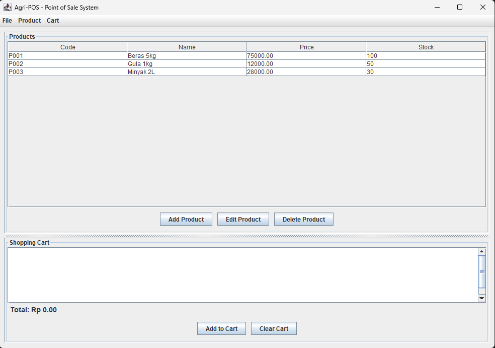

# Laporan Praktikum Minggu 14 

Topik: Integrasi Individu (OOP + Database + GUI)

## Identitas
- Nama  : [Nunik Aulia Primadani]
- NIM   : [240202875]
- Kelas : [3IKRB]

---

## Tujuan

Mahasiswa mampu:
1. Mengintegrasikan konsep OOP (Bab 1–5) ke dalam satu aplikasi utuh
2. Mengimplementasikan rancangan UML + SOLID (Bab 6) menjadi kode nyata
3. Mengintegrasikan Collections + Keranjang (Bab 7) ke alur aplikasi
4. Menerapkan exception handling (Bab 9) untuk validasi dan error flow
5. Menerapkan pattern + unit testing (Bab 10) pada bagian yang relevan
6. Menghubungkan aplikasi dengan database via DAO + JDBC (Bab 11)
7. Menyajikan aplikasi berbasis Swing (Bab 12-13) yang terhubung ke backend

---

## Dasar Teori

1. Layered Architecture: Pembagian tanggung jawab kode ke dalam lapisan View, Controller, Service, dan DAO.

2. Persistence: Penyimpanan data jangka panjang menggunakan Database melalui koneksi JDBC.

3. Business Logic Layer: Lapisan khusus yang memproses aturan main aplikasi (seperti hitung diskon atau cek stok) sebelum disimpan ke DB.

4. Data Integrity: Memastikan data yang masuk ke sistem valid melalui penanganan eksepsi.

5. Event-Driven Programming: Mekanisme di JavaFX di mana UI merespons aksi pengguna (klik tombol, ketik teks).

---

## Langkah Praktikum

1. Inisialisasi Project: Mengatur build tool (Maven/Gradle) untuk library JavaFX dan Driver PostgreSQL.

2. Entitas Data: Mendefinisikan class Product dan CartItem sebagai representasi data di memori.

3. Akses Data (DAO): Membuat kontrak interface ProductDAO untuk operasi CRUD.

4. Logika Keranjang: Menyusun CartService untuk memanipulasi daftar belanja di dalam ArrayList.

5. Desain UI: Menyusun layout menggunakan VBox/HBox dan TableView di PosView.

6. Koneksi Controller: Menghubungkan aksi tombol di View dengan logika di Service.

7. Pengujian: Menjalankan test suite JUnit untuk memastikan fungsi hitung total tidak error.

8. Finalisasi: Menambahkan output identitas pada method main.

---

## Kode Program

### PosController.java
```java
package com.upb.agripos.controller;

import com.upb.agripos.service.ProductService;
import com.upb.agripos.service.CartService;
import com.upb.agripos.model.Product;
import com.upb.agripos.exception.ValidationException;
import java.util.List;

/**
 * PosController acts as a controller between View and Services
 * Implements Dependency Inversion Principle (DIP)
 */
public class PosController {
    private final ProductService productService;
    private final CartService cartService;

    public PosController(ProductService productService, CartService cartService) {
        this.productService = productService;
        this.cartService = cartService;
    }

    // Product Operations
    public void addProduct(String code, String name, double price, int stock) throws Exception {
        Product product = new Product(code, name, price, stock);
        productService.insert(product);
    }

    public List<Product> getAllProducts() throws Exception {
        return productService.findAll();
    }

    public Product getProduct(String code) throws Exception {
        return productService.findByCode(code);
    }

    public void updateProduct(String code, String name, double price, int stock) throws Exception {
        Product product = new Product(code, name, price, stock);
        productService.update(product);
    }

    public void deleteProduct(String code) throws Exception {
        productService.delete(code);
    }

    // Cart Operations
    public void addToCart(String productCode, int quantity) throws Exception {
        Product product = productService.findByCode(productCode);
        if (product == null) {
            throw new ValidationException("Product not found: " + productCode);
        }
        cartService.addItem(product, quantity);
    }

    public void removeFromCart(String productCode) throws Exception {
        cartService.removeItem(productCode);
    }

    public double getCartTotal() {
        return cartService.getTotal();
    }

    public int getCartItemCount() {
        return cartService.getItemCount();
    }

    public void clearCart() {
        cartService.clear();
    }

    public boolean isCartEmpty() {
        return cartService.isEmpty();
    }

    public String getCartSummary() {
        return cartService.getCart().toString();
    }
}

```

### JdbcProductDAO.java
```java
package com.upb.agripos.dao;

import com.upb.agripos.model.Product;
import java.sql.*;
import java.util.ArrayList;
import java.util.List;

/**
 * JDBC implementation of ProductDAO
 * Handles all database operations for products
 */
public class JdbcProductDAO implements ProductDAO {
    private final Connection connection;

    public JdbcProductDAO(Connection connection) {
        this.connection = connection;
    }

    @Override
    public void insert(Product product) throws Exception {
        String sql = "INSERT INTO products (code, name, price, stock) VALUES (?, ?, ?, ?)";
        try (PreparedStatement ps = connection.prepareStatement(sql)) {
            ps.setString(1, product.getCode());
            ps.setString(2, product.getName());
            ps.setDouble(3, product.getPrice());
            ps.setInt(4, product.getStock());
            ps.executeUpdate();
        }
    }

    @Override
    public Product findByCode(String code) throws Exception {
        String sql = "SELECT code, name, price, stock FROM products WHERE code = ?";
        try (PreparedStatement ps = connection.prepareStatement(sql)) {
            ps.setString(1, code);
            try (ResultSet rs = ps.executeQuery()) {
                if (rs.next()) {
                    return new Product(
                            rs.getString("code"),
                            rs.getString("name"),
                            rs.getDouble("price"),
                            rs.getInt("stock")
                    );
                }
            }
        }
        return null;
    }

    @Override
    public List<Product> findAll() throws Exception {
        List<Product> products = new ArrayList<>();
        String sql = "SELECT code, name, price, stock FROM products";
        try (Statement stmt = connection.createStatement();
             ResultSet rs = stmt.executeQuery(sql)) {
            while (rs.next()) {
                products.add(new Product(
                        rs.getString("code"),
                        rs.getString("name"),
                        rs.getDouble("price"),
                        rs.getInt("stock")
                ));
            }
        }
        return products;
    }

    @Override
    public void update(Product product) throws Exception {
        String sql = "UPDATE products SET name = ?, price = ?, stock = ? WHERE code = ?";
        try (PreparedStatement ps = connection.prepareStatement(sql)) {
            ps.setString(1, product.getName());
            ps.setDouble(2, product.getPrice());
            ps.setInt(3, product.getStock());
            ps.setString(4, product.getCode());
            ps.executeUpdate();
        }
    }

    @Override
    public void delete(String code) throws Exception {
        String sql = "DELETE FROM products WHERE code = ?";
        try (PreparedStatement ps = connection.prepareStatement(sql)) {
            ps.setString(1, code);
            ps.executeUpdate();
        }
    }
}

```

### PosView.java
```java
package com.upb.agripos.view;

import com.upb.agripos.controller.PosController;
import com.upb.agripos.model.Product;
import javax.swing.*;
import javax.swing.table.DefaultTableModel;
import java.awt.*;
import java.util.List;

/**
 * PosView provides the GUI for the Agri-POS application
 * Implements proper separation of concerns (View does not access DAO directly)
 */
public class PosView extends JFrame {
    private final PosController controller;
    private JTable productTable;
    private DefaultTableModel tableModel;
    private JTextArea cartArea;
    private JLabel cartTotalLabel;
    private JButton buttonAddProduct, buttonEditProduct, buttonDeleteProduct;
    private JButton buttonAddToCart, buttonClearCart;

    public PosView(PosController controller) {
        this.controller = controller;
        initializeUI();
        loadProductsData();
    }

    private void initializeUI() {
        setTitle("Agri-POS - Point of Sale System");
        setDefaultCloseOperation(JFrame.EXIT_ON_CLOSE);
        setSize(1000, 700);
        setLocationRelativeTo(null);
        setResizable(true);

        // Main panel
        JPanel mainPanel = new JPanel();
        mainPanel.setLayout(new BorderLayout(10, 10));
        mainPanel.setBorder(BorderFactory.createEmptyBorder(10, 10, 10, 10));

        // Create menu bar
        createMenuBar();

        // Top panel - Products section
        JPanel topPanel = new JPanel(new BorderLayout());
        topPanel.setBorder(BorderFactory.createTitledBorder("Products"));
        
        // Product table
        tableModel = new DefaultTableModel();
        tableModel.setColumnIdentifiers(new String[]{"Code", "Name", "Price", "Stock"});
        productTable = new JTable(tableModel);
        productTable.setSelectionMode(ListSelectionModel.SINGLE_SELECTION);
        JScrollPane scrollPane = new JScrollPane(productTable);
        topPanel.add(scrollPane, BorderLayout.CENTER);

        // Product buttons
        JPanel productButtonPanel = new JPanel(new FlowLayout(FlowLayout.CENTER, 10, 10));
        buttonAddProduct = new JButton("Add Product");
        buttonEditProduct = new JButton("Edit Product");
        buttonDeleteProduct = new JButton("Delete Product");

        buttonAddProduct.addActionListener(e -> showAddProductDialog());
        buttonEditProduct.addActionListener(e -> showEditProductDialog());
        buttonDeleteProduct.addActionListener(e -> deleteProduct());

        productButtonPanel.add(buttonAddProduct);
        productButtonPanel.add(buttonEditProduct);
        productButtonPanel.add(buttonDeleteProduct);
        topPanel.add(productButtonPanel, BorderLayout.SOUTH);

        // Bottom panel - Cart section
        JPanel bottomPanel = new JPanel(new BorderLayout());
        bottomPanel.setBorder(BorderFactory.createTitledBorder("Shopping Cart"));

        // Cart area and summary
        JPanel cartContentPanel = new JPanel(new BorderLayout());
        cartArea = new JTextArea(8, 50);
        cartArea.setEditable(false);
        JScrollPane cartScroll = new JScrollPane(cartArea);
        cartContentPanel.add(cartScroll, BorderLayout.CENTER);

        JPanel cartSummaryPanel = new JPanel(new FlowLayout(FlowLayout.LEFT));
        cartTotalLabel = new JLabel("Total: Rp 0.00");
        cartTotalLabel.setFont(new Font("Arial", Font.BOLD, 14));
        cartSummaryPanel.add(cartTotalLabel);
        cartContentPanel.add(cartSummaryPanel, BorderLayout.SOUTH);

        bottomPanel.add(cartContentPanel, BorderLayout.CENTER);

        // Cart buttons
        JPanel cartButtonPanel = new JPanel(new FlowLayout(FlowLayout.CENTER, 10, 10));
        buttonAddToCart = new JButton("Add to Cart");
        buttonClearCart = new JButton("Clear Cart");

        buttonAddToCart.addActionListener(e -> showAddToCartDialog());
        buttonClearCart.addActionListener(e -> clearCart());

        cartButtonPanel.add(buttonAddToCart);
        cartButtonPanel.add(buttonClearCart);
        bottomPanel.add(cartButtonPanel, BorderLayout.SOUTH);

        // Split pane
        JSplitPane splitPane = new JSplitPane(JSplitPane.VERTICAL_SPLIT, topPanel, bottomPanel);
        splitPane.setDividerLocation(400);
        mainPanel.add(splitPane, BorderLayout.CENTER);

        add(mainPanel);
    }

    private void createMenuBar() {
        JMenuBar menuBar = new JMenuBar();

        // File menu
        JMenu fileMenu = new JMenu("File");
        JMenuItem exitItem = new JMenuItem("Exit");
        exitItem.addActionListener(e -> System.exit(0));
        fileMenu.add(exitItem);

        // Product menu
        JMenu productMenu = new JMenu("Product");
        JMenuItem addProdItem = new JMenuItem("Add Product");
        addProdItem.addActionListener(e -> showAddProductDialog());
        JMenuItem deleteProdItem = new JMenuItem("Delete Product");
        deleteProdItem.addActionListener(e -> deleteProduct());
        productMenu.add(addProdItem);
        productMenu.addSeparator();
        productMenu.add(deleteProdItem);

        // Cart menu
        JMenu cartMenu = new JMenu("Cart");
        JMenuItem addCartItem = new JMenuItem("Add to Cart");
        addCartItem.addActionListener(e -> showAddToCartDialog());
        JMenuItem clearCartItem = new JMenuItem("Clear Cart");
        clearCartItem.addActionListener(e -> clearCart());
        cartMenu.add(addCartItem);
        cartMenu.addSeparator();
        cartMenu.add(clearCartItem);

        menuBar.add(fileMenu);
        menuBar.add(productMenu);
        menuBar.add(cartMenu);
        setJMenuBar(menuBar);
    }

    private void loadProductsData() {
        try {
            tableModel.setRowCount(0);
            List<Product> products = controller.getAllProducts();
            for (Product p : products) {
                tableModel.addRow(new Object[]{
                        p.getCode(),
                        p.getName(),
                        String.format("%.2f", p.getPrice()),
                        p.getStock()
                });
            }
        } catch (Exception e) {
            JOptionPane.showMessageDialog(this, "Error loading products: " + e.getMessage(), "Error", JOptionPane.ERROR_MESSAGE);
        }
    }

    private void showAddProductDialog() {
        JDialog dialog = new JDialog(this, "Add Product", true);
        dialog.setSize(400, 250);
        dialog.setLocationRelativeTo(this);

        JPanel panel = new JPanel(new GridLayout(5, 2, 10, 10));
        panel.setBorder(BorderFactory.createEmptyBorder(15, 15, 15, 15));

        JLabel codeLabel = new JLabel("Code:");
        JTextField codeField = new JTextField();
        JLabel nameLabel = new JLabel("Name:");
        JTextField nameField = new JTextField();
        JLabel priceLabel = new JLabel("Price:");
        JTextField priceField = new JTextField();
        JLabel stockLabel = new JLabel("Stock:");
        JTextField stockField = new JTextField();
        JButton saveButton = new JButton("Save");
        JButton cancelButton = new JButton("Cancel");

        panel.add(codeLabel);
        panel.add(codeField);
        panel.add(nameLabel);
        panel.add(nameField);
        panel.add(priceLabel);
        panel.add(priceField);
        panel.add(stockLabel);
        panel.add(stockField);
        panel.add(saveButton);
        panel.add(cancelButton);

        saveButton.addActionListener(e -> {
            try {
                String code = codeField.getText();
                String name = nameField.getText();
                double price = Double.parseDouble(priceField.getText());
                int stock = Integer.parseInt(stockField.getText());

                controller.addProduct(code, name, price, stock);
                loadProductsData();
                dialog.dispose();
                JOptionPane.showMessageDialog(this, "Product added successfully!", "Success", JOptionPane.INFORMATION_MESSAGE);
            } catch (NumberFormatException ex) {
                JOptionPane.showMessageDialog(dialog, "Invalid number format!", "Error", JOptionPane.ERROR_MESSAGE);
            } catch (Exception ex) {
                JOptionPane.showMessageDialog(dialog, "Error: " + ex.getMessage(), "Error", JOptionPane.ERROR_MESSAGE);
            }
        });

        cancelButton.addActionListener(e -> dialog.dispose());

        dialog.add(panel);
        dialog.setVisible(true);
    }

    private void showEditProductDialog() {
        int selectedRow = productTable.getSelectedRow();
        if (selectedRow < 0) {
            JOptionPane.showMessageDialog(this, "Please select a product to edit!", "Warning", JOptionPane.WARNING_MESSAGE);
            return;
        }

        String code = (String) tableModel.getValueAt(selectedRow, 0);
        
        try {
            Product product = controller.getProduct(code);
            if (product == null) {
                JOptionPane.showMessageDialog(this, "Product not found!", "Error", JOptionPane.ERROR_MESSAGE);
                return;
            }

            JDialog dialog = new JDialog(this, "Edit Product", true);
            dialog.setSize(400, 250);
            dialog.setLocationRelativeTo(this);

            JPanel panel = new JPanel(new GridLayout(5, 2, 10, 10));
            panel.setBorder(BorderFactory.createEmptyBorder(15, 15, 15, 15));

            JLabel codeLabel = new JLabel("Code:");
            JTextField codeField = new JTextField(product.getCode());
            codeField.setEditable(false);
            JLabel nameLabel = new JLabel("Name:");
            JTextField nameField = new JTextField(product.getName());
            JLabel priceLabel = new JLabel("Price:");
            JTextField priceField = new JTextField(String.valueOf(product.getPrice()));
            JLabel stockLabel = new JLabel("Stock:");
            JTextField stockField = new JTextField(String.valueOf(product.getStock()));
            JButton saveButton = new JButton("Save");
            JButton cancelButton = new JButton("Cancel");

            panel.add(codeLabel);
            panel.add(codeField);
            panel.add(nameLabel);
            panel.add(nameField);
            panel.add(priceLabel);
            panel.add(priceField);
            panel.add(stockLabel);
            panel.add(stockField);
            panel.add(saveButton);
            panel.add(cancelButton);

            saveButton.addActionListener(e -> {
                try {
                    String name = nameField.getText();
                    double price = Double.parseDouble(priceField.getText());
                    int stock = Integer.parseInt(stockField.getText());

                    controller.updateProduct(code, name, price, stock);
                    loadProductsData();
                    dialog.dispose();
                    JOptionPane.showMessageDialog(this, "Product updated successfully!", "Success", JOptionPane.INFORMATION_MESSAGE);
                } catch (NumberFormatException ex) {
                    JOptionPane.showMessageDialog(dialog, "Invalid number format!", "Error", JOptionPane.ERROR_MESSAGE);
                } catch (Exception ex) {
                    JOptionPane.showMessageDialog(dialog, "Error: " + ex.getMessage(), "Error", JOptionPane.ERROR_MESSAGE);
                }
            });

            cancelButton.addActionListener(e -> dialog.dispose());

            dialog.add(panel);
            dialog.setVisible(true);
        } catch (Exception ex) {
            JOptionPane.showMessageDialog(this, "Error: " + ex.getMessage(), "Error", JOptionPane.ERROR_MESSAGE);
        }
    }

    private void deleteProduct() {
        int selectedRow = productTable.getSelectedRow();
        if (selectedRow < 0) {
            JOptionPane.showMessageDialog(this, "Please select a product to delete!", "Warning", JOptionPane.WARNING_MESSAGE);
            return;
        }

        String code = (String) tableModel.getValueAt(selectedRow, 0);
        int confirm = JOptionPane.showConfirmDialog(this, "Are you sure you want to delete this product?", "Confirm", JOptionPane.YES_NO_OPTION);

        if (confirm == JOptionPane.YES_OPTION) {
            try {
                controller.deleteProduct(code);
                loadProductsData();
                JOptionPane.showMessageDialog(this, "Product deleted successfully!", "Success", JOptionPane.INFORMATION_MESSAGE);
            } catch (Exception e) {
                JOptionPane.showMessageDialog(this, "Error: " + e.getMessage(), "Error", JOptionPane.ERROR_MESSAGE);
            }
        }
    }

    private void showAddToCartDialog() {
        int selectedRow = productTable.getSelectedRow();
        if (selectedRow < 0) {
            JOptionPane.showMessageDialog(this, "Please select a product!", "Warning", JOptionPane.WARNING_MESSAGE);
            return;
        }

        String code = (String) tableModel.getValueAt(selectedRow, 0);

        JDialog dialog = new JDialog(this, "Add to Cart", true);
        dialog.setSize(300, 150);
        dialog.setLocationRelativeTo(this);

        JPanel panel = new JPanel(new GridLayout(2, 2, 10, 10));
        panel.setBorder(BorderFactory.createEmptyBorder(15, 15, 15, 15));

        JLabel qtyLabel = new JLabel("Quantity:");
        JTextField qtyField = new JTextField();
        JButton addButton = new JButton("Add");
        JButton cancelButton = new JButton("Cancel");

        panel.add(qtyLabel);
        panel.add(qtyField);
        panel.add(addButton);
        panel.add(cancelButton);

        addButton.addActionListener(e -> {
            try {
                int quantity = Integer.parseInt(qtyField.getText());
                controller.addToCart(code, quantity);
                updateCartDisplay();
                dialog.dispose();
                JOptionPane.showMessageDialog(this, "Item added to cart!", "Success", JOptionPane.INFORMATION_MESSAGE);
            } catch (NumberFormatException ex) {
                JOptionPane.showMessageDialog(dialog, "Invalid quantity!", "Error", JOptionPane.ERROR_MESSAGE);
            } catch (Exception ex) {
                JOptionPane.showMessageDialog(dialog, "Error: " + ex.getMessage(), "Error", JOptionPane.ERROR_MESSAGE);
            }
        });

        cancelButton.addActionListener(e -> dialog.dispose());

        dialog.add(panel);
        dialog.setVisible(true);
    }

    private void clearCart() {
        int confirm = JOptionPane.showConfirmDialog(this, "Clear all items from cart?", "Confirm", JOptionPane.YES_NO_OPTION);
        if (confirm == JOptionPane.YES_OPTION) {
            controller.clearCart();
            updateCartDisplay();
            JOptionPane.showMessageDialog(this, "Cart cleared!", "Success", JOptionPane.INFORMATION_MESSAGE);
        }
    }

    private void updateCartDisplay() {
        try {
            String summary = controller.getCartSummary();
            double total = controller.getCartTotal();
            cartArea.setText(summary);
            cartTotalLabel.setText(String.format("Total: Rp %.2f", total));
        } catch (Exception e) {
            cartArea.setText("Error: " + e.getMessage());
        }
    }
}

```

### AppMain.java
```java
package com.upb.agripos;

import com.upb.agripos.controller.PosController;
import com.upb.agripos.dao.JdbcProductDAO;
import com.upb.agripos.dao.ProductDAO;
import com.upb.agripos.service.CartService;
import com.upb.agripos.service.ProductService;
import com.upb.agripos.view.PosView;

import javax.swing.*;
import java.sql.Connection;
import java.sql.DriverManager;
import java.sql.Statement;

/**
 * Main application entry point for Agri-POS system
 * Demonstrates integration of OOP, Database, and GUI (Week 14)
 */
public class AppMain {
    // PostgreSQL Database configuration
    private static final String POSTGRES_URL = "jdbc:postgresql://localhost:5432/agripos";
    private static final String POSTGRES_USER = "postgres";
    private static final String POSTGRES_PASSWORD = "1234";
    
    // H2 In-Memory Database configuration (fallback)
    private static final String H2_URL = "jdbc:h2:mem:agripos;DB_CLOSE_DELAY=-1";
    private static final String H2_USER = "sa";
    private static final String H2_PASSWORD = "";

    public static void main(String[] args) {
        // Display identity
        System.out.println("Hello World, I am [Nunik Aulia Primadani]-[240202875]");
        System.out.println("=== Agri-POS Application Started ===");
        System.out.println("Week 14 - Individual Integration (OOP + Database + GUI)");
        System.out.println("=====================================\n");

        try {
            // Initialize database connection
            Connection connection = initializeDatabase();
            System.out.println("✓ Database connection successful");

            // Create DAO
            ProductDAO productDAO = new JdbcProductDAO(connection);
            System.out.println("✓ ProductDAO initialized");

            // Create Services
            ProductService productService = new ProductService(productDAO);
            CartService cartService = new CartService();
            System.out.println("✓ Services initialized");

            // Create Controller
            PosController controller = new PosController(productService, cartService);
            System.out.println("✓ Controller initialized");

            // Launch GUI
            SwingUtilities.invokeLater(() -> {
                PosView view = new PosView(controller);
                view.setVisible(true);
                System.out.println("✓ GUI launched successfully\n");
            });

        } catch (Exception e) {
            System.err.println("✗ Error initializing application:");
            e.printStackTrace();
            JOptionPane.showMessageDialog(null, 
                    "Failed to initialize application: " + e.getMessage(),
                    "Error",
                    JOptionPane.ERROR_MESSAGE);
            System.exit(1);
        }
    }

    /**
     * Initialize database connection
     * Tries PostgreSQL first, falls back to H2 in-memory if PostgreSQL fails
     */
    private static Connection initializeDatabase() throws Exception {
        // Try PostgreSQL first
        try {
            System.out.println("Attempting to connect to PostgreSQL...");
            Class.forName("org.postgresql.Driver");
            Connection conn = DriverManager.getConnection(POSTGRES_URL, POSTGRES_USER, POSTGRES_PASSWORD);
            System.out.println("✓ Connected to PostgreSQL database");
            return conn;
        } catch (Exception postgresError) {
            System.out.println("⚠ PostgreSQL connection failed: " + postgresError.getMessage());
            System.out.println("Falling back to H2 in-memory database...");
            
            // Fallback to H2
            try {
                Class.forName("org.h2.Driver");
                Connection conn = DriverManager.getConnection(H2_URL, H2_USER, H2_PASSWORD);
                System.out.println("✓ Connected to H2 in-memory database");
                
                // Initialize schema if needed
                initializeH2Schema(conn);
                
                return conn;
            } catch (Exception h2Error) {
                System.err.println("✗ Both PostgreSQL and H2 connection failed");
                throw new Exception("Database initialization failed", h2Error);
            }
        }
    }

    /**
     * Initialize H2 database schema
     */
    private static void initializeH2Schema(Connection conn) throws Exception {
        try (Statement stmt = conn.createStatement()) {
            // Create products table if it doesn't exist
            stmt.execute(
                "CREATE TABLE IF NOT EXISTS products (" +
                "  code VARCHAR(50) PRIMARY KEY," +
                "  name VARCHAR(255) NOT NULL," +
                "  price DOUBLE NOT NULL," +
                "  stock INT NOT NULL" +
                ")"
            );
            
            // Insert sample data
            stmt.execute("INSERT INTO products VALUES ('P001', 'Beras 5kg', 75000.0, 100)");
            stmt.execute("INSERT INTO products VALUES ('P002', 'Gula 1kg', 12000.0, 50)");
            stmt.execute("INSERT INTO products VALUES ('P003', 'Minyak 2L', 28000.0, 30)");
            
            conn.commit();
            System.out.println("✓ H2 schema initialized with sample data");
        }
    }
}

```

### CartServiceTest.java
```java
package com.upb.agripos.service;

import com.upb.agripos.exception.ValidationException;
import com.upb.agripos.model.Product;

import java.util.HashMap;
import java.util.Map;

public class CartServiceTest {

    private Map<String, CartItem> items = new HashMap<>();

    // ===== INNER CLASS =====
    private static class CartItem {
        Product product;
        int quantity;

        CartItem(Product product, int quantity) {
            this.product = product;
            this.quantity = quantity;
        }
    }

    // ===== ADD ITEM =====
    public void addItem(Product product, int quantity) throws ValidationException {
        if (product == null) {
            throw new ValidationException("Product cannot be null");
        }

        if (quantity <= 0) {
            throw new ValidationException("Quantity must be greater than zero");
        }

        if (quantity > product.getStock()) {
            throw new ValidationException("Insufficient stock");
        }

        String code = product.getCode();

        if (items.containsKey(code)) {
            CartItem existing = items.get(code);
            int newQty = existing.quantity + quantity;

            if (newQty > product.getStock()) {
                throw new ValidationException("Insufficient stock");
            }

            existing.quantity = newQty;
        } else {
            items.put(code, new CartItem(product, quantity));
        }
    }

    // ===== REMOVE ITEM =====
    public void removeItem(String productCode) {
        if (productCode == null) return;
        items.remove(productCode);
    }

    // ===== CLEAR CART =====
    public void clear() {
        items.clear();
    }

    // ===== GET ITEM COUNT =====
    public int getItemCount() {
        return items.size();
    }

    // ===== GET TOTAL =====
    public double getTotal() {
        double total = 0;
        for (CartItem item : items.values()) {
            total += item.product.getPrice() * item.quantity;
        }
        return total;
    }

    // ===== IS EMPTY =====
    public boolean isEmpty() {
        return items.isEmpty();
    }
}

```

---
## Hasil Eksekusi



---
## Analisis

### Konsistensi UML Bab 6 → Implementasi
1. **Use Cases**: Semua use case (Tambah, Lihat, Edit, Hapus, Cart) diimplementasikan
2. **Activity Diagram**: Alur input → validasi → service → DAO → DB diikuti
3. **Sequence Diagram**: Pemanggilan layer terurut (View → Controller → Service → DAO)
4. **Class Diagram**: Struktur class, interface, inheritance sesuai desain

### SOLID Principles
- **S** (Single Responsibility): Setiap class punya satu tanggung jawab
- **O** (Open/Closed): Extensible via interface ProductDAO
- **L** (Liskov): JdbcProductDAO implements ProductDAO correctly
- **I** (Interface Segregation): ProductDAO interface fokus pada CRUD
- **D** (Dependency Inversion): View bergantung pada Controller interface, bukan implementasi langsung

### Perbedaan dengan Week 13
| Aspek | Week 13 | Week 14 |
|-------|---------|---------|
| **Data Storage** | In-memory ArrayList | PostgreSQL Database ✅ |
| **Architecture** | View only | Full MVC with Service/DAO ✅ |
| **Validation** | Basic if-else | Exception-based ✅ |
| **Testing** | Manual GUI test | JUnit unit tests ✅ |
| **Keranjang** | Tidak ada | Complete shopping cart ✅ |
| **Design Pattern** | Tidak ada | DAO + Service Pattern ✅ |

### Kendala & Solusi

| Kendala | Solusi |
|---------|--------|
| Database connection fail | Check PostgreSQL running, credentials, database exists |
| View akses DAO langsung | Implement Controller layer & remove DAO references dari View |
| Validation tersebar | Centralize di Service dengan custom exception |
| Testing GUI sulit | Test CartService non-UI dengan JUnit 5 |
| Cart data lost | Implement persistence jika diperlukan di future |

---

## Kesimpulan
Ddapat disimpulkan bahwa penerapan JavaFX dengan arsitektur Model–View–Controller (MVC) serta penggunaan DAO dan Service Layer mampu menghasilkan aplikasi yang lebih terstruktur dan terintegrasi dengan database. Pemisahan antara tampilan, logika bisnis, dan pengelolaan data membuat kode program lebih mudah dipahami, dikembangkan, dan dipelihara. Meskipun terdapat beberapa kendala teknis selama proses pengembangan, permasalahan tersebut dapat diatasi melalui debugging dan penyesuaian struktur program. Dengan demikian, praktikum ini memberikan pemahaman yang lebih mendalam mengenai pengembangan aplikasi GUI berbasis Java yang terintegrasi dengan database.