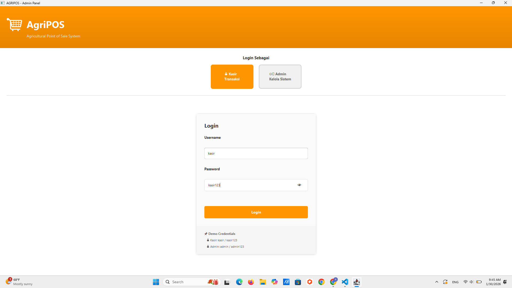
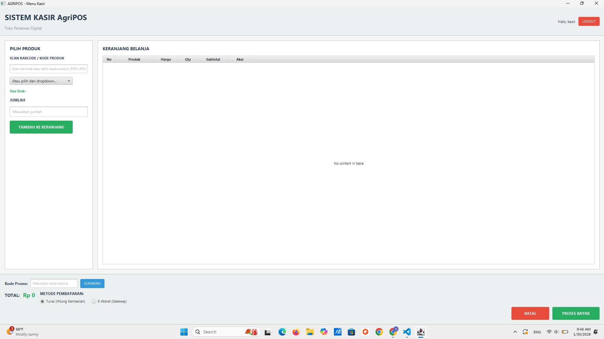
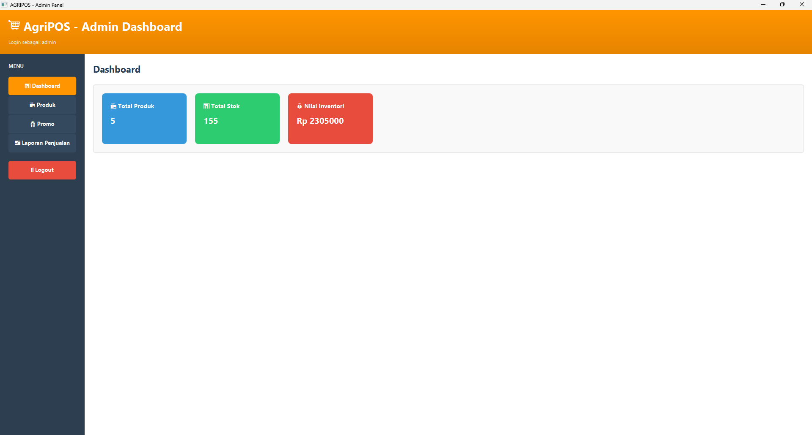
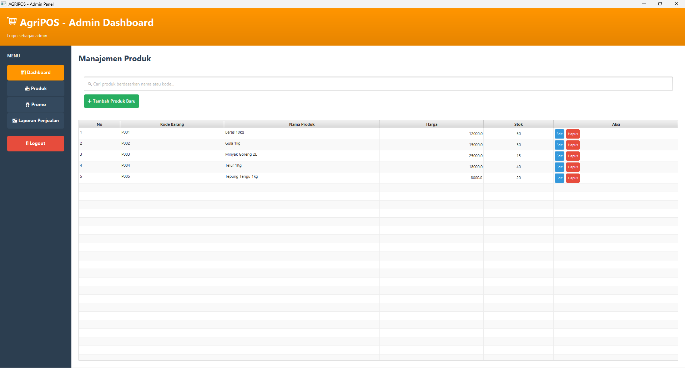
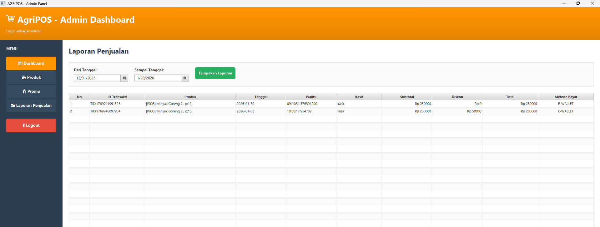

# Laporan Praktikum Minggu 15 
Topik: Proyek Kelompok (Desain Sistem + Implementasi Terintegrasi + Testing + Dokumentasi)

## Identitas
- Nama  : [Nunik Aulia Primadani]
- NIM   : [240202875]
- Kelas : [3IKRB]

---

## Tujuan

Tujuan dari proyek ini adalah:
  - Mengembangkan aplikasi Java terintegrasi secara kolaboratif.
  - Mendesain sistem menggunakan UML (Use Case, Class, dan Sequence Diagram).
  - Menerapkan arsitektur berlapis (View–Controller–Service–DAO–DB) sesuai prinsip SOLID dan DIP.
  - Melakukan pengujian sistem menggunakan test plan dan unit test.
  - Menyusun dokumentasi teknis dan laporan proyek secara lengkap.
---

## Dasar Teori

  1. Arsitektur Berlapis (Layered Architecture)
     Sistem dibagi ke dalam beberapa lapisan yaitu View, Controller, Service, DAO, dan Database untuk memisahkan tanggung jawab dan mempermudah pengembangan.

  2. Unified Modeling Language (UML)
     UML digunakan untuk memodelkan kebutuhan, struktur, dan alur sistem melalui Use Case, Class, dan Sequence Diagram.

  3. Prinsip SOLID
     Prinsip SOLID diterapkan agar kode lebih terstruktur, mudah dipelihara, dan mudah dikembangkan.

   4. Pengujian Perangkat Lunak
      Pengujian dilakukan untuk memastikan sistem berjalan sesuai kebutuhan melalui pengujian manual dan unit test.

---

## Langkah Praktikum

  1. Persiapan Proyek
     Menyalin (clone) base code Agri-POS dari praktikum Bab 14 sebagai dasar pengembangan proyek kelompok, kemudian mengatur struktur direktori sesuai ketentuan.

  2. Perancangan Sistem
     Menyusun desain sistem menggunakan UML yang meliputi Use Case Diagram, Class Diagram, dan Sequence Diagram sesuai kebutuhan fungsional.

  3. Implementasi Sistem
     Mengembangkan aplikasi secara terintegrasi dengan menerapkan arsitektur berlapis (View–Controller–Service–DAO–Database) menggunakan JavaFX, JDBC, dan PostgreSQL.

  4. Pengujian Sistem
     Melakukan pengujian manual pada fitur utama serta menjalankan unit test menggunakan JUnit untuk logika non-UI.

  5. Dokumentasi dan Versi Kontrol
     Menyusun dokumentasi proyek dalam bentuk laporan dan melakukan kolaborasi menggunakan GitHub dengan commit yang bermakna dari setiap anggota.

---

## Kode Program

1. ProductController.java

```java
package com.upb.agripos.controller;

import java.util.List;

import com.upb.agripos.model.Product;
import com.upb.agripos.service.ProductService;

public class ProductController {

    private final ProductService productService;

    public ProductController(ProductService productService) {
        this.productService = productService;
    }

    public void addProduct(String id, String name, double price, int stock) {
        Product product = new Product(id, name, price, stock);
        productService.addProduct(product);
    }

    public List<Product> getAllProducts() {
        return productService.getAllProducts();
    }

    public Product getProductById(String id) {
        return productService.getProductById(id);
    }

    public void updateStock(String productId, int newStock) {
        productService.updateStock(productId, newStock);
    }

    public void updateProduct(String id, String name, double price, int stock) {
        Product product = new Product(id, name, price, stock);
        productService.updateProduct(product);
    }

    public void deleteProduct(String id) {
        productService.deleteProduct(id);
    }
}
```

2. AppJava.java
```java
package com.upb.agripos;

import javafx.application.Application;
import javafx.scene.Scene;
import javafx.scene.control.Button;
import javafx.scene.control.Label;
import javafx.scene.control.PasswordField;
import javafx.scene.control.TextField;
import javafx.scene.layout.VBox;
import javafx.stage.Stage;

/**
 * Main entry point for Agri-POS Application
 * Initializes JavaFX window and displays login screen
 */
public class App extends Application {

    @Override
    public void start(Stage primaryStage) throws Exception {
        try {
            // Set up main window
            primaryStage.setTitle("Agri-POS - Agricultural Point of Sale System");
            primaryStage.setWidth(600);
            primaryStage.setHeight(500);
            
            // Create simple login screen
            VBox root = new VBox(20);
            root.setStyle("-fx-padding: 40; -fx-alignment: center;");
            
            Label titleLabel = new Label("Agri-POS Login");
            titleLabel.setStyle("-fx-font-size: 24; -fx-font-weight: bold;");
            
            Label userLabel = new Label("Username:");
            TextField userField = new TextField();
            userField.setPromptText("Enter username");
            userField.setMaxWidth(300);
            
            Label passLabel = new Label("Password:");
            PasswordField passField = new PasswordField();
            passField.setPromptText("Enter password");
            passField.setMaxWidth(300);
            
            Button loginBtn = new Button("Login");
            loginBtn.setStyle("-fx-padding: 10; -fx-font-size: 14;");
            loginBtn.setOnAction(e -> {
                String username = userField.getText();
                String password = passField.getText();
                if (username.isEmpty() || password.isEmpty()) {
                    System.out.println("Please enter username and password");
                } else {
                    System.out.println("Login attempt: " + username);
                }
            });
            
            root.getChildren().addAll(
                titleLabel,
                userLabel, userField,
                passLabel, passField,
                loginBtn
            );
            
            Scene scene = new Scene(root, 600, 500);
            primaryStage.setScene(scene);
            primaryStage.show();
            
        } catch (Exception e) {
            System.err.println("Error starting application: " + e.getMessage());
            e.printStackTrace();
        }
    }

    public static void main(String[] args) {
        launch(args);
    }
}
```
3. ProductService.java
```java
package com.upb.agripos.service;

import java.util.List;

import com.upb.agripos.dao.JdbcProductDAO;
import com.upb.agripos.dao.ProductDAO;
import com.upb.agripos.model.Product;

public class ProductService {

    private final ProductDAO productDAO = new JdbcProductDAO();

    public void addProduct(Product product) {
        productDAO.save(product);
    }

    public List<Product> getAllProducts() {
        return productDAO.findAll();
    }

    public Product getProductById(String id) {
        return productDAO.findById(id);
    }

    public void updateStock(String id, int qty) {
        Product p = productDAO.findById(id);
        if (p != null) {
            p.reduceStock(qty);
        }
    }

    public void updateProduct(Product product) {
        productDAO.update(product);
    }

    public void deleteProduct(String id) {
        productDAO.delete(id);
    }
}
```

4. ProductDAO.java
```java
package com.upb.agripos.dao;

import java.util.List;

import com.upb.agripos.model.Product;

public interface ProductDAO {
    void save(Product product);
    Product findById(String id);
    List<Product> findAll();
    void update(Product product);
    void delete(String id);
}
```
---

## Hasil Eksekusi

  1. Login


  2. Dashboard Kasir


  3. Dashboard Admin


  4. Manajemen Produk 


  5. Laporan Penjualan


---

## Analisis

Kode program berjalan dengan menerapkan arsitektur berlapis. Interaksi pengguna pada antarmuka (JavaFX) ditangani oleh Controller, kemudian diteruskan ke Service untuk diproses sebagai logika bisnis. Selanjutnya, Service memanggil DAO untuk melakukan akses data ke database PostgreSQL. Hasil pemrosesan dikembalikan secara berurutan dari DAO ke Service, Controller, lalu ditampilkan kembali pada tampilan (View).

Pendekatan ini membuat alur program lebih terstruktur, mudah dipelihara, dan memisahkan tampilan dari logika bisnis serta akses data.

---

## Kontribusi Kelompok

Peran utama yang saya jalankan adalah sebagai Backend Service Developer. Kontribusi difokuskan pada pengembangan dan pengelolaan layer Service yang menangani logika bisnis utama aplikasi Agri-POS.

Kontribusi yang dilakukan meliputi pengembangan ProductService untuk mengelola proses bisnis manajemen produk, seperti validasi data, pengolahan aturan bisnis, serta penghubung antara Controller dan DAO. Selain itu, dilakukan implementasi DiscountStrategy (OFR-2) dengan menerapkan pola desain Strategy untuk mendukung perhitungan diskon secara fleksibel tanpa mengubah kode inti sistem.

Kontribusi lainnya mencakup perancangan dan implementasi business logic pada proses transaksi, termasuk perhitungan total belanja dan penerapan aturan diskon. Seluruh pengembangan dilakukan dengan tetap mengikuti arsitektur berlapis, prinsip SOLID, serta memastikan bahwa logika bisnis tidak ditempatkan pada layer antarmuka (GUI).

## Kesimpulan

Berdasarkan praktikum Week 15, dapat disimpulkan bahwa pengembangan aplikasi Agri-POS berhasil dilakukan secara terintegrasi dengan menerapkan arsitektur berlapis, prinsip SOLID, serta pemodelan sistem menggunakan UML. Sistem yang dibangun mampu memenuhi kebutuhan fungsional utama, didukung oleh pengujian dasar dan dokumentasi yang rapi sehingga aplikasi siap untuk didemonstrasikan dan dikembangkan lebih lanjut.
---
