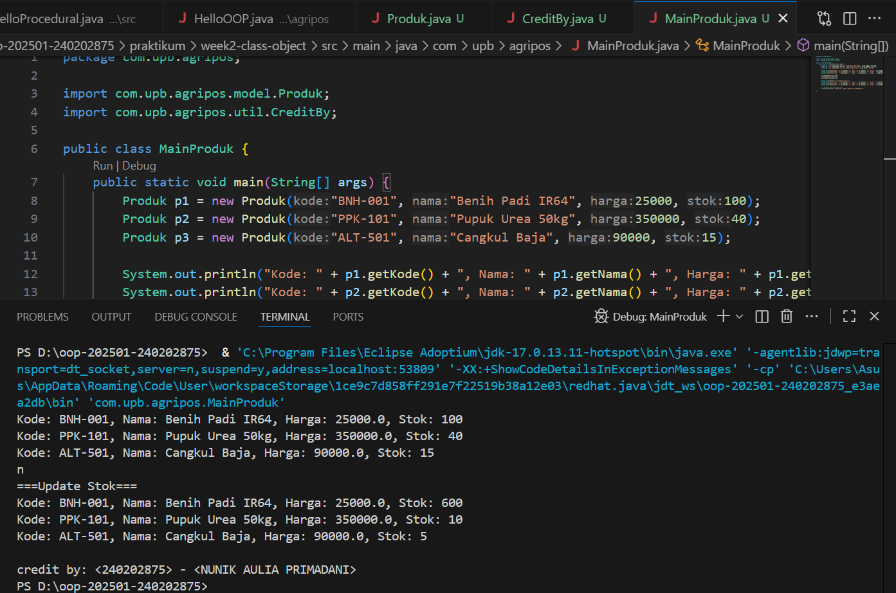

# Laporan Praktikum Minggu 1 (sesuaikan minggu ke berapa?)
Topik: [Class dan Object (Produk Pertanian)]

## Identitas
- Nama  : [Nunik Aulia Primadani]
- NIM   : [240202875]
- Kelas : [3IKRB]

---

## Tujuan
Mahasiswa mampu menjelaskan konsep class, object, atribut, dan method dalam OOP.
Mahasiswa mampu menerapkan access modifier dan enkapsulasi dalam pembuatan class.
Mahasiswa mampu mengimplementasikan class Produk pertanian dengan atribut dan method yang sesuai.
Mahasiswa mampu mendemonstrasikan instansiasi object serta menampilkan data produk pertanian di console.
Mahasiswa mampu menyusun laporan praktikum dengan bukti kode, hasil eksekusi, dan analisis sederhana.

---

## Dasar Teori
Class adalah blueprint atau cetak biru dari sebuah objek. Objek merupakan instansiasi dari class yang berisi atribut (data) dan method (perilaku). Dalam OOP, enkapsulasi dilakukan dengan menyembunyikan data menggunakan access modifier (public, private, protected) serta menyediakan akses melalui getter dan setter.

Dalam konteks Agri-POS, produk pertanian seperti benih, pupuk, dan alat pertanian dapat direpresentasikan sebagai objek yang memiliki atribut nama, harga, dan stok. Dengan menggunakan class, setiap produk dapat dibuat, dikelola, dan dimanipulasi secara lebih terstruktur.

---

## Langkah Praktikum

1. Membuat Class Produk

Buat file Produk.java pada package model.
Tambahkan atribut: kode, nama, harga, dan stok.
Gunakan enkapsulasi dengan menjadikan atribut bersifat private dan membuat getter serta setter untuk masing-masing atribut.

2. Membuat Class CreditBy

Buat file CreditBy.java pada package util.
Isi class dengan method statis untuk menampilkan identitas mahasiswa di akhir output: credit by: <NIM> - <Nama>.

3. Membuat Objek Produk dan Menampilkan Credit

Buat file MainProduk.java.
Instansiasi minimal tiga objek produk, misalnya "Benih Padi", "Pupuk Urea", dan satu produk alat pertanian.
Tampilkan informasi produk melalui method getter.
Panggil CreditBy.print("<NIM>", "<Nama>") di akhir main untuk menampilkan identitas.

4. Commit dan Push

Commit dengan pesan: week2-class-object.

---

## Kode Program  
1. Produk.java

```java

package com.upb.agripos.model;

public class Produk {
    private String kode;
    private String nama;
    private double harga;
    private int stok;

    public Produk(String kode, String nama, double harga, int stok) {
        this.kode = kode;
        this.nama = nama;
        this.harga = harga;
        this.stok = stok;
    }

    public String getKode() { return kode; }
    public void setKode(String kode) { this.kode = kode; }

    public String getNama() { return nama; }
    public void setNama(String nama) { this.nama = nama; }

    public double getHarga() { return harga; }
    public void setHarga(double harga) { this.harga = harga; }

    public int getStok() { return stok; }
    public void setStok(int stok) { this.stok = stok; }

    public void tambahStok(int jumlah) {
        this.stok += jumlah;
    }

    public void kurangiStok(int jumlah) {
        if (this.stok >= jumlah) {
            this.stok -= jumlah;
        } else {
            System.out.println("Stok tidak mencukupi!");
        }
    }
}
```

2. Credit.By.java

```java

package com.upb.agripos.util;

public class CreditBy {
    public static void print(String nim, String nama) {
        System.out.println("\ncredit by: " + nim + " - " + nama);
    }
}
```
3. MainProduk.java

```java
package com.upb.agripos;

import com.upb.agripos.model.Produk;
import com.upb.agripos.util.CreditBy;

public class MainProduk {
    public static void main(String[] args) {
        Produk p1 = new Produk("BNH-001", "Benih Padi IR64", 25000, 100);
        Produk p2 = new Produk("PPK-101", "Pupuk Urea 50kg", 350000, 40);
        Produk p3 = new Produk("ALT-501", "Cangkul Baja", 90000, 15);

        System.out.println("Kode: " + p1.getKode() + ", Nama: " + p1.getNama() + ", Harga: " + p1.getHarga() + ", Stok: " + p1.getStok());
        System.out.println("Kode: " + p2.getKode() + ", Nama: " + p2.getNama() + ", Harga: " + p2.getHarga() + ", Stok: " + p2.getStok());
        System.out.println("Kode: " + p3.getKode() + ", Nama: " + p3.getNama() + ", Harga: " + p3.getHarga() + ", Stok: " + p3.getStok());

        p1.tambahStok(500);
        p2.kurangiStok(30);
        p3.kurangiStok(10);

        System.out.println("n\n===Update Stok===");
        System.out.println("Kode: " + p1.getKode() + ", Nama: " + p1.getNama() + ", Harga: " + p1.getHarga() + ", Stok: " + p1.getStok());
        System.out.println("Kode: " + p2.getKode() + ", Nama: " + p2.getNama() + ", Harga: " + p2.getHarga() + ", Stok: " + p2.getStok());
        System.out.println("Kode: " + p3.getKode() + ", Nama: " + p3.getNama() + ", Harga: " + p3.getHarga() + ", Stok: " + p3.getStok());

        // Tampilkan identitas mahasiswa
        CreditBy.print("<240202875>", "<NUNIK AULIA PRIMADANI>");
    }
}
```

---

## Hasil Eksekusi
(

)
---

## Analisis
(
- Program berjalan sesuai konsep OOP. Class Produk menyimpan data dan method untuk manipulasi stok. Di MainProduk, dibuat tiga object produk dengan nilai berbeda dan dilakukan operasi penambahan dan pengurangan stok. Output mencerminkan perubahan nilai atribut objek.

- Pendekatan minggu ini lebih terstruktur dibanding pendekatan procedural karena data produk dibungkus dalam satu class, sehingga mudah digunakan berulang dan dikembangkan lebih lanjut untuk sistem POS.

- Tidak ada error, hanya perlu memastikan import path benar sesuai struktur package
)
---

## Kesimpulan
(*Dengan menerapkan class dan object, program menjadi lebih terstruktur, reusable, dan mudah dikembangkan ke level aplikasi yang lebih kompleks seperti sistem POS. Enkapsulasi menjaga integritas data agar tidak diakses atau dimodifikasi secara langsung tanpa kontrol.*)

---

## Quiz
(1. [Mengapa atribut sebaiknya dideklarasikan sebagai private dalam class?]  
   **Jawaban:** Atribut dalam class sebaiknya dideklarasikan sebagai private untuk menerapkan prinsip enkapsulasi dalam pemrograman berorientasi objek (OOP). Ini melindungi data internal class dari akses langsung oleh kode eksternal, mencegah modifikasi yang tidak diinginkan atau kesalahan yang dapat merusak integritas objek. Dengan private, akses ke atribut hanya bisa dilakukan melalui metode publik (seperti getter dan setter), yang memungkinkan kontrol penuh atas bagaimana data diakses atau diubah. Hal ini meningkatkan keamanan, modularitas, dan kemudahan pemeliharaan kode, seperti dalam bahasa Java di mana private mencegah manipulasi langsung dari luar class.

2. [Apa fungsi getter dan setter dalam enkapsulasi?]  
   **Jawaban:** Getter dan setter adalah metode publik yang digunakan untuk mengakses dan memodifikasi atribut private dalam class, sebagai bagian dari enkapsulasi.

Getter (misalnya, getNama()): Berfungsi untuk mengambil nilai atribut private tanpa mengizinkan perubahan langsung, memastikan data hanya dibaca. Ini berguna untuk validasi atau pemrosesan sebelum pengembalian nilai.
Setter (misalnya, setNama(String nama)): Berfungsi untuk mengatur nilai atribut private, sering kali dengan validasi (seperti memeriksa rentang nilai atau format) untuk mencegah input yang tidak valid. Bersama getter, setter memungkinkan kontrol penuh atas data, meningkatkan keamanan dan fleksibilitas, seperti dalam class Produk di mana setter bisa memvalidasi harga positif.

3. [Bagaimana cara class Produk mendukung pengembangan aplikasi POS yang lebih kompleks?]  
   **Jawaban:** Class Produk mendukung pengembangan aplikasi Point of Sale (POS) yang lebih kompleks dengan menyediakan struktur data terorganisir untuk mengelola item penjualan, yang dapat diperluas untuk fitur lanjutan. Misalnya:

Enkapsulasi data: Atribut private seperti nama, harga, stok, dan kategori dilindungi, dengan getter/setter untuk akses terkendali, memungkinkan validasi (e.g., harga tidak negatif) dan integrasi dengan database.
Modularitas: Metode seperti hitungTotal() atau kurangiStok() memfasilitasi logika bisnis, seperti perhitungan diskon atau pembaruan inventori otomatis saat transaksi.
Ekstensibilitas: Class ini bisa diwariskan (inheritance) untuk subclass seperti ProdukElektronik dengan atribut tambahan (e.g., garansi), mendukung fitur kompleks seperti analitik penjualan, integrasi API pembayaran, atau multi-toko. Ini mengurangi duplikasi kode dan mempermudah pengembangan skala besar, seperti dalam sistem POS berbasis Java. )
