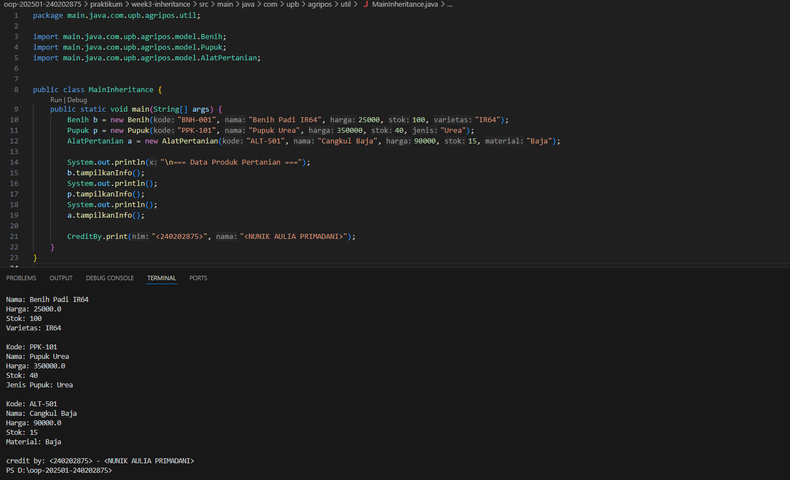

# Laporan Praktikum Minggu 3 (sesuaikan minggu ke berapa?)
Topik: [Inheritance (Kategori Produk)]

## Identitas
- Nama  : [NUNIK AULIA PRIMADANI]
- NIM   : [240202875]
- Kelas : [3 IKRB]

---

## Tujuan
Mahasiswa mampu menjelaskan konsep inheritance (pewarisan class) dalam OOP.
Mahasiswa mampu membuat superclass dan subclass untuk produk pertanian.
Mahasiswa mampu mendemonstrasikan hierarki class melalui contoh kode.
Mahasiswa mampu menggunakan super untuk memanggil konstruktor dan method parent class.
Mahasiswa mampu membuat laporan praktikum yang menjelaskan perbedaan penggunaan inheritance dibanding class tunggal.

---

## Dasar Teori
Inheritance adalah mekanisme dalam OOP yang memungkinkan suatu class mewarisi atribut dan method dari class lain.

Superclass: class induk yang mendefinisikan atribut umum.
Subclass: class turunan yang mewarisi atribut/method superclass, dan dapat menambahkan atribut/method baru.
super digunakan untuk memanggil konstruktor atau method superclass.
Dalam konteks Agri-POS, kita dapat membuat class Produk sebagai superclass, kemudian Benih, Pupuk, dan AlatPertanian sebagai subclass. Hal ini membuat kode lebih reusable dan terstruktur.

---

## Langkah Praktikum
1. Membuat Superclass Produk
Gunakan class Produk dari Bab 2 sebagai superclass.

2. Membuat Subclass
Benih.java → atribut tambahan: varietas.
Pupuk.java → atribut tambahan: jenis pupuk (Urea, NPK, dll).
AlatPertanian.java → atribut tambahan: material (baja, kayu, plastik).

3. Membuat Main Class
Instansiasi minimal satu objek dari tiap subclass.
Tampilkan data produk dengan memanfaatkan inheritance.

4. Menambahkan CreditBy
Panggil class CreditBy untuk menampilkan identitas mahasiswa.

5. Commit dan Push
Commit dengan pesan: week3-inheritance.

---

## Kode Program
1. AlatPertanian.java

```java

package main.java.com.upb.agripos.model;

public class AlatPertanian extends Produk {
    private String material;

    public AlatPertanian(String kode, String nama, double harga, int stok, String material) {
        super(kode, nama, harga, stok);
        this.material = material;
    }
    public String getMaterial() { 
        return material; 
    }
    public void setMaterial(String material) { 
        this.material = material; 
    }

    @Override
    public void tampilkanInfo() {
        super.tampilkanInfo();
        System.out.println("Material: " + material);
    }
}
```
2. Benih.java

```java

package main.java.com.upb.agripos.model;

public class Benih extends Produk {
    private String varietas;

    public Benih(String kode, String nama, double harga, int stok, String varietas) {
        super(kode, nama, harga, stok);
        this.varietas = varietas;
    }

    public String getVarietas() { 
        return varietas; 
    }
    public void setVarietas(String varietas) { 
        this.varietas = varietas; 
    }

    @Override
    public void tampilkanInfo() {
        super.tampilkanInfo(); // tampilkan info dari Produk
        System.out.println("Varietas: " + varietas);
    }
}
```
3. Produk.java

```java

package main.java.com.upb.agripos.model;

public class Produk {
    private String kode;
    private String nama;
    private double harga;
    private int stok;

    public Produk(String kode, String nama, double harga, int stok) {
        this.kode = kode;
        this.nama = nama;
        this.harga = harga;
        this.stok = stok;
    }

    public String getKode() { return kode; }
    public void setKode(String kode) { this.kode = kode; }

    public String getNama() { return nama; }
    public void setNama(String nama) { this.nama = nama; }

    public double getHarga() { return harga; }
    public void setHarga(double harga) { this.harga = harga; }

    public int getStok() { return stok; }
    public void setStok(int stok) { this.stok = stok; }

    public void tambahStok(int jumlah) {
        this.stok += jumlah;
    }

    public void kurangiStok(int jumlah) {
        if (this.stok >= jumlah) {
            this.stok -= jumlah;
        } else {
            System.out.println("Stok tidak mencukupi!");
        }
    }

    public void tampilkanInfo() {
        System.out.println("Kode: " + kode);
        System.out.println("Nama: " + nama);
        System.out.println("Harga: " + harga);
        System.out.println("Stok: " + stok);
    }
}
```
3. Pupuk.java

```java

package main.java.com.upb.agripos.model;

public class Pupuk extends Produk {
    private String jenis;

    public Pupuk(String kode, String nama, double harga, int stok, String jenis) {
        super(kode, nama, harga, stok);
        this.jenis = jenis;
    }

    public String getJenis() { 
        return jenis; 
    }
    public void setJenis(String jenis) { 
        this.jenis = jenis; 
    }

    @Override
    public void tampilkanInfo() {
        super.tampilkanInfo();
        System.out.println("Jenis Pupuk: " + jenis);
    }
}
```
3. CreditBy.java

```java

package main.java.com.upb.agripos.util;

public class CreditBy {
    public static void print(String nim, String nama) {
        System.out.println("\ncredit by: " + nim + " - " + nama);
    }
}
```

4. MainInheritance.java

```java

package main.java.com.upb.agripos.util;

import main.java.com.upb.agripos.model.Benih;
import main.java.com.upb.agripos.model.Pupuk;
import main.java.com.upb.agripos.model.AlatPertanian;


public class MainInheritance {
    public static void main(String[] args) {
        Benih b = new Benih("BNH-001", "Benih Padi IR64", 25000, 100, "IR64");
        Pupuk p = new Pupuk("PPK-101", "Pupuk Urea", 350000, 40, "Urea");
        AlatPertanian a = new AlatPertanian("ALT-501", "Cangkul Baja", 90000, 15, "Baja");

        System.out.println("\n=== Data Produk Pertanian ===");
        b.tampilkanInfo();
        System.out.println();
        p.tampilkanInfo();
        System.out.println();
        a.tampilkanInfo();

        CreditBy.print("<240202875>", "<NUNIK AULIA PRIMADANI>");
    }
}
```

---

## Hasil Eksekusi
(Sertakan screenshot hasil eksekusi program.  

)
---

## Analisis
( Program ini menunjukkan implementasi konsep inheritance (pewarisan) dalam Java. Class Produk berperan sebagai superclass yang menampung atribut dan method umum dari semua produk. Kemudian, class Benih, Pupuk, dan AlatPertanian menjadi subclass yang mewarisi atribut dan method dari Produk serta menambahkan atribut khusus masing-masing.

Saat objek subclass dibuat, constructor subclass akan memanggil constructor superclass menggunakan super(...).

Method tampilkanInfo() di subclass menggunakan overriding, yaitu memanggil super.tampilkanInfo() terlebih dahulu untuk menampilkan data umum, lalu menambahkan data khusus subclass.

Perbedaan dengan minggu sebelumnya: Pada minggu sebelumnya, setiap class berdiri sendiri tanpa pewarisan. Minggu ini program lebih terstruktur dan efisien karena menggunakan konsep inheritance, sehingga tidak perlu menulis ulang atribut dan method yang sama di setiap class. 
)
Kendala: Awalnya terjadi error pada struktur package (package com.upb.agripos vs main.java.com.upb.agripos). Solusinya adalah memastikan struktur folder dan deklarasi package sesuai dengan letak file di dalam proyek Java.
---

## Kesimpulan
(Dengan menggunakan inheritance, program menjadi lebih terorganisir, mudah dikembangkan, dan mengurangi duplikasi kode. Konsep ini memungkinkan reuse (penggunaan ulang) kode superclass di subclass dengan penambahan fitur yang lebih spesifik.)

---

## Quiz
(1. [Apa keuntungan menggunakan inheritance dibanding membuat class terpisah tanpa hubungan?]  
   **Jawaban:** Inheritance memungkinkan subclass mewarisi dari superclass, memberikan keuntungan dibanding class terpisah tanpa hubungan:

Reusabilitas Kode: Hindari duplikasi; subclass gunakan metode superclass tanpa tulis ulang.
Maintenance Mudah: Perubahan di superclass otomatis berlaku ke subclass, kurangi risiko inkonsistensi.
Polimorfisme: Objek subclass diperlakukan sebagai superclass, fleksibel untuk operasi umum.
Hierarki Logis: Cerminkan relasi dunia nyata (e.g., "Mobil adalah Kendaraan"), buat kode intuitif.
Efisiensi: Kurangi redundansi, hemat memori, dan percepat pengembangan. 

2. [Bagaimana cara subclass memanggil konstruktor superclass?]  
   **Jawaban:** Dengan menggunakan keyword super(...) di baris pertama konstruktor subclass untuk meneruskan nilai ke konstruktor superclass. 

3. [Berikan contoh kasus di POS pertanian selain Benih, Pupuk, dan Alat Pertanian yang bisa dijadikan subclass.]  
   **Jawaban:** ObatTanaman dengan atribut tambahan seperti kandunganAktif atau dosisPemakaian. )
