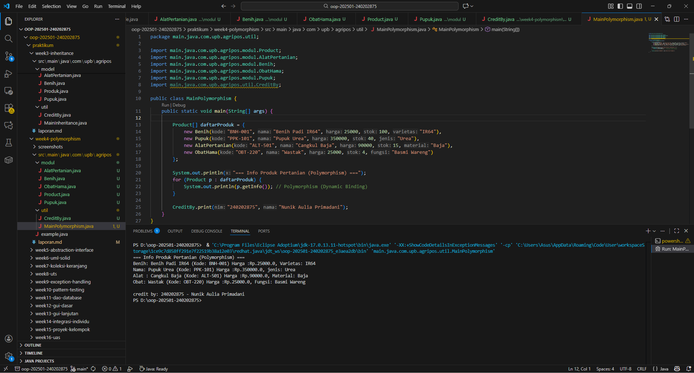

# Laporan Praktikum Minggu 1 (sesuaikan minggu ke berapa?)
Topik: [Tuliskan judul topik, misalnya "Class dan Object"]

## Identitas
- Nama  : [Nunik Aulia Primadani]
- NIM   : [240202875]
- Kelas : [3IKRB]

---

## Tujuan
- Mahasiswa mampu menjelaskan konsep polymorphism dalam OOP.
- Mahasiswa mampu membedakan method overloading dan overriding.
- Mahasiswa mampu mampu mengimplementasikan polymorphism (overriding, overloading, dynamic binding) dalam program.
- Mahasiswa mampu mampu menganalisis contoh kasus polymorphism pada sistem nyata (Agri-POS).

---

## Dasar Teori
Polymorphism berarti “banyak bentuk” dan memungkinkan objek yang berbeda merespons panggilan method yang sama dengan cara yang berbeda.

1. Overloading → mendefinisikan method dengan nama sama tetapi parameter berbeda.
2. Overriding → subclass mengganti implementasi method dari superclass.
3. Dynamic Binding → pemanggilan method ditentukan saat runtime, bukan compile time.

Dalam konteks Agri-POS, misalnya:

1. Method getInfo() pada Produk dioverride oleh Benih, Pupuk, AlatPertanian untuk menampilkan detail spesifik.
2. Method tambahStok() bisa dibuat overload dengan parameter berbeda (int, double).

---

## Langkah Praktikum
1. Overloading
Tambahkan method tambahStok(int jumlah) dan tambahStok(double jumlah) pada class Produk.

2. Overriding
Tambahkan method getInfo() pada superclass Produk. b. Override method getInfo() pada subclass Benih, Pupuk, dan AlatPertanian.

3. Dynamic Binding
Buat array Produk[] daftarProduk yang berisi objek Benih, Pupuk, dan AlatPertanian. b. Loop array tersebut dan panggil getInfo(). Perhatikan bagaimana Java memanggil method sesuai jenis objek aktual.

4. Main Class

Buat MainPolymorphism.java untuk mendemonstrasikan overloading, overriding, dan dynamic binding.

5. CreditBy
Tetap panggil CreditBy.print("", "").

6. Commit dan Push
Commit dengan pesan: week4-polymorphism.

---

## Kode Program 
1. AlatPertanian.java

```java
package main.java.com.upb.agripos.modul;

public class AlatPertanian extends Product{

    private String material;

    public AlatPertanian(String kode, String nama, double harga, int stok, String material) {
        super(kode, nama, harga, stok);
        this.material = material;
    }

    @Override
    public String getInfo() {
        return "Alat : "+  super.getInfo() + ", Material: " + material ;
    }
}
```

2. Benih.java

```java
package main.java.com.upb.agripos.modul;

public class Benih extends  Product{

    private String varietas;

    public Benih(String kode, String nama, double harga, int stok, String varietas) {
        super(kode, nama, harga, stok);
        this.varietas = varietas;
    }

    @Override
    public String getInfo() {
        return "Benih: " + super.getInfo() + ", Varietas: " + varietas;
    }
}
```
3. ObatHama.java

```java
package main.java.com.upb.agripos.modul;

public class ObatHama extends Product{

    String fungsi;

    public ObatHama(String kode, String nama, double harga, int stok, String fungsi) {
        super(kode, nama, harga, stok);
        this.fungsi = fungsi;
    }

    @Override
    public String getInfo() {
        return "Obat: " + super.getInfo() + ", Fungsi: " + fungsi;
    }
}
```

4. Product.java

```java
package main.java.com.upb.agripos.modul;

public class Product {
    private String kode;
    private String nama;
    private double harga;
    private int stok;

    public Product(String kode, String nama, double harga, int stok) {
        this.kode = kode;
        this.nama = nama;
        this.harga = harga;
        this.stok = stok;
    }

    public void tambahStok(int jumlah) {
        this.stok += jumlah;
    }

    public void kurangiStok(int jumlah) {
        if (this.stok >= jumlah) {
            this.stok -= jumlah;
        } else {
            System.out.println("Stok tidak mencukupi!");
        }
    }
    public String getInfo() {
        return nama + " (Kode: " + kode + ")" + " Harga :" + "Rp." + Double.toString(harga);
    }
}
```

5. Pupuk.java

```java
package main.java.com.upb.agripos.modul;

public class Pupuk extends  Product{

    private String jenis;

    public Pupuk(String kode, String nama, double harga, int stok, String jenis) {
        super(kode, nama, harga, stok);
        this.jenis = jenis;
    }

    @Override
    public String getInfo() {
        return "Nama: " + super.getInfo() + ", jenis: " + jenis;
    }
}
```

6. CreditBy.java

```java
package main.java.com.upb.agripos.util;

public class CreditBy {
    public static void print(String nim, String nama) {
        System.out.println("\ncredit by: " + nim + " - " + nama);
    }
}
```

7. MainPolymorphism.java

```java
package main.java.com.upb.agripos.util;

import main.java.com.upb.agripos.modul.Product;
import main.java.com.upb.agripos.modul.AlatPertanian;
import main.java.com.upb.agripos.modul.Benih;
import main.java.com.upb.agripos.modul.ObatHama;
import main.java.com.upb.agripos.modul.Pupuk;
import main.java.com.upb.agripos.util.CreditBy;

public class MainPolymorphism {
    public static void main(String[] args) {

        Product[] daftarProduk = {
            new Benih("BNH-001", "Benih Padi IR64", 25000, 100, "IR64"),
            new Pupuk("PPK-101", "Pupuk Urea", 350000, 40, "Urea"),
            new AlatPertanian("ALT-501", "Cangkul Baja", 90000, 15, "Baja"),
            new ObatHama("OBT-220", "Wastak", 25000, 4, "Basmi Wareng")
        };

        System.out.println("=== Info Produk Pertanian (Polymorphism) ===");
        for (Product p : daftarProduk) {
            System.out.println(p.getInfo()); // Polymorphism (Dynamic Binding)
        }

        CreditBy.print("240202875", "Nunik Aulia Primadani");
    }
}
```

---

## Hasil Eksekusi
(Sertakan screenshot hasil eksekusi program.  

)
---

## Analisis
(
- Jelaskan bagaimana kode berjalan.
**Jawaban:** Program berjalan dengan menerapkan konsep polymorphism di mana objek-objek dari subclass seperti Benih, Pupuk, AlatPertanian, dan ObatHama disimpan dalam array bertipe superclass Produk. Saat perulangan memanggil getInfo(), Java secara otomatis menentukan method mana yang dijalankan berdasarkan tipe objek sebenarnya (dynamic binding). Method tambahStok() pada class Produk juga menunjukkan overloading karena memiliki dua versi dengan parameter berbeda (int dan double). Setiap subclass melakukan overriding pada getInfo() untuk menampilkan informasi spesifik masing-masing produk. Setelah semua data ditampilkan, method CreditBy.print() dipanggil untuk menampilkan identitas pembuat program.

- Apa perbedaan pendekatan minggu ini dibanding minggu sebelumnya.
**Jawaban:** Perbedaan utama antara praktikum minggu ke-4 dan minggu ke-3 terletak pada fokus penerapan konsep OOP yang digunakan. Pada minggu ke-3, program menekankan konsep inheritance (pewarisan), di mana subclass seperti Benih, Pupuk, dan AlatPertanian mewarisi atribut serta method dari superclass Produk. Tujuannya adalah untuk membentuk hierarki class agar kode lebih efisien dan terstruktur. Sedangkan pada minggu ke-4, fokusnya bergeser ke polymorphism, yaitu kemampuan objek dari subclass yang berbeda untuk merespons panggilan method yang sama dengan cara berbeda. Konsep ini diterapkan melalui method overriding, overloading, dan dynamic binding agar program dapat memanggil method sesuai jenis objek aktualnya, meskipun disimpan dalam referensi bertipe superclass. Dengan demikian, jika minggu ke-3 menekankan hubungan pewarisan antarclass, minggu ke-4 memperluasnya menjadi perilaku dinamis antar objek, sehingga kode menjadi lebih fleksibel, adaptif, dan mudah dikembangkan.

- Kendala yang dihadapi dan cara mengatasinya.
**Jawaban:** Kendala yang dihadapi biasanya muncul pada saat proses overriding, seperti lupa menambahkan anotasi @Override atau kesalahan dalam pemanggilan super.getInfo(), yang menyebabkan error kompilasi atau hasil informasi tidak sesuai. Cara mengatasinya adalah dengan memastikan struktur pewarisan benar, penggunaan nama method sama persis seperti di superclass, dan menjalankan program secara bertahap untuk mengecek setiap class sudah berfungsi sesuai konsep polymorphism.
)
---

## Kesimpulan
(*Dapat disimpulkan bahwa konsep polymorphism memungkinkan satu method yang sama dijalankan dengan perilaku berbeda tergantung pada objek yang memanggilnya. Melalui penerapan overloading, overriding, dan dynamic binding pada kelas Produk dan turunannya (Benih, Pupuk, AlatPertanian, dan ObatHama), program mampu menampilkan informasi produk secara dinamis sesuai jenis objek. Dengan demikian, polymorphism mempermudah pengelolaan kode, meningkatkan fleksibilitas, serta mendukung prinsip reusability dan extensibility dalam pemrograman berorientasi objek.*)

---

## Quiz
(1. [Apa perbedaan overloading dan overriding?]  
   **Jawaban:** Overloading terjadi ketika dua atau lebih method memiliki nama yang sama tetapi berbeda pada jumlah atau tipe parameternya dalam satu class. Sedangkan overriding terjadi ketika subclass mengganti implementasi method dari superclass dengan nama, parameter, dan tipe kembalian yang sama untuk menyesuaikan perilaku sesuai kebutuhan subclass. 

2. [Bagaimana Java menentukan method mana yang dipanggil dalam dynamic binding?]  
   **Jawaban:** Dalam dynamic binding, Java menentukan method mana yang dipanggil berdasarkan tipe objek sebenarnya saat runtime, bukan tipe referensinya. Artinya, meskipun variabel bertipe superclass, method yang dijalankan tetap milik subclass tempat objek tersebut dibuat. 

3. [Berikan contoh kasus polymorphism dalam sistem POS selain produk pertanian!]  
   **Jawaban:** Contoh kasus polymorphism dalam sistem POS selain produk pertanian adalah pada sistem kasir restoran, di mana class MenuItem memiliki subclass Makanan, Minuman, dan Dessert yang masing-masing mengoverride method getInfo() untuk menampilkan detail spesifik seperti ukuran porsi, rasa, atau tingkat manis sesuai jenis menu.  )
