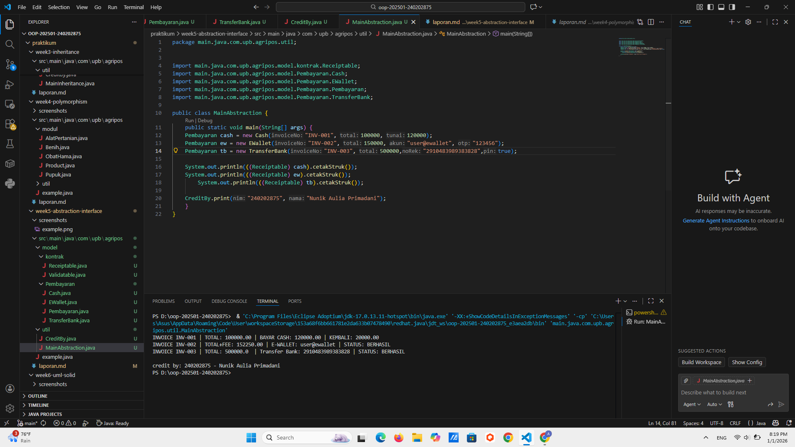

# Laporan Praktikum Minggu 5 
Topik: [Abstraction (Abstract Class & Interface)]

## Identitas
- Nama  : [Nunik Aulia Primadani]
- NIM   : [240202875]
- Kelas : [3IKRB]

---

## Tujuan
*Mahasiswa mampu menjelaskan perbedaan abstract class dan interface.*
*Mahasiswa mampu  mampu mendesain abstract class dengan method abstrak sesuai kebutuhan kasus.*
*Mahasiswa mampu membuat interface dan mengimplementasikannya pada class.*
*Mahasiswa mampu menerapkan multiple inheritance melalui interface pada rancangan kelas.*
*Mahasiswa mampu mendokumentasikan kode (komentar kelas/method, README singkat pada folder minggu).*
   
---

## Dasar Teori
Abstraksi adalah proses menyederhanakan kompleksitas dengan menampilkan elemen penting dan menyembunyikan detail implementasi.

- Abstract class: tidak dapat diinstansiasi, dapat memiliki method abstrak (tanpa badan) dan non-abstrak. Dapat menyimpan state (field).
- Interface: kumpulan kontrak (method tanpa implementasi konkret). Sejak Java 8 mendukung default method. Mendukung multiple inheritance (class dapat mengimplementasikan banyak interface).
- Gunakan abstract class bila ada shared state dan perilaku dasar; gunakan interface untuk mendefinisikan kemampuan/kontrak lintas hierarki.

Dalam konteks Agri-POS, Pembayaran dapat dimodelkan sebagai abstract class dengan method abstrak prosesPembayaran() dan biaya(). Implementasi konkritnya: Cash dan EWallet. Kemudian, interface seperti Validatable (mis. verifikasi OTP) dan Receiptable (mencetak bukti) dapat diimplementasikan oleh jenis pembayaran yang relevan.

---

## Langkah Praktikum
1. Abstract Class – Pembayaran

○ Buat Pembayaran(abstract) dengan field invoiceNo, total dan method:
- double biaya() (abstrak) → biaya tambahan (fee).
- boolean prosesPembayaran() (abstrak) → mengembalikan status berhasil/gagal.
- double totalBayar() (konkrit) → return total + biaya();.

2. Subclass Konkret

○ Cash → biaya = 0, proses = selalu berhasil jika tunai >= totalBayar().
○ EWallet → biaya = 1.5% dari total; proses = membutuhkan validasi.

3. Interface

○ Validatable → boolean validasi(); (contoh: OTP).
○ Receiptable → String cetakStruk();

4. Multiple Inheritance via Interface

○ EWallet mengimplementasikan dua interface: Validatable, Receiptable.
○ Cash setidaknya mengimplementasikan Receiptable.

5. Main Class

○ Buat MainAbstraction.java untuk mendemonstrasikan pemakaian Pembayaran (polimorfik).
○ Tampilkan hasil proses dan struk. Di akhir, panggil CreditBy.print("[NIM]", "[Nama]").

6. Commit dan Push

○ Commit dengan pesan: week5-abstraction-interface.


---

## Kode Program

1. Receiptable.java

```java
package main.java.com.upb.agripos.model.kontrak;

public interface Receiptable {
    String cetakStruk();
}
```

2. Validatable.java

```java
package main.java.com.upb.agripos.model.kontrak;

public interface Validatable {
    boolean validasi();
}
```

3. Cash.java

```java
package main.java.com.upb.agripos.model.Pembayaran;

import main.java.com.upb.agripos.model.kontrak.Receiptable;

public class Cash extends Pembayaran implements Receiptable {
    private double tunai;

    public Cash(String invoiceNo, double total, double tunai) {
        super(invoiceNo, total);
        this.tunai = tunai;
    }

    @Override
    public double biaya() {
        return 0.0;
    }

    @Override
    public boolean prosesPembayaran() {
        return tunai >= totalBayar(); // sederhana: cukup uang tunai
    }

    @Override
    public String cetakStruk() {
        return String.format("INVOICE %s | TOTAL: %.2f | BAYAR CASH: %.2f | KEMBALI: %.2f",
                invoiceNo, totalBayar(), tunai, Math.max(0, tunai - totalBayar()));
    }
}
```

4. EWallet.java

```java
package main.java.com.upb.agripos.model.Pembayaran;

import main.java.com.upb.agripos.model.kontrak.Receiptable;
import main.java.com.upb.agripos.model.kontrak.Validatable;

public class EWallet extends Pembayaran implements Validatable,Receiptable {

    private String akun;
    private String otp; // sederhana untuk simulasi

    public EWallet(String invoiceNo, double total, String akun, String otp) {
        super(invoiceNo,total);
        this.akun = akun;
        this.otp = otp;
    }

    @Override
    public double biaya() {
        return total * 0.015; // 1.5% fee
    }

    @Override
    public boolean validasi() {
        return otp != null && otp.length() == 6; // contoh validasi sederhana
    }

    @Override
    public boolean prosesPembayaran() {
        return validasi(); // jika validasi lolos, anggap berhasil
    }

    @Override
    public String cetakStruk() {
        return String.format("INVOICE %s | TOTAL+FEE: %.2f | E-WALLET: %s | STATUS: %s",
                invoiceNo, totalBayar(), akun, prosesPembayaran() ? "BERHASIL" : "GAGAL");
    }
}
```

5. Pembayaran.java

```java
package main.java.com.upb.agripos.model.Pembayaran;

public abstract class Pembayaran {

    protected String invoiceNo;
    protected double total;

    public Pembayaran(String invoiceNo, double total) {
        this.invoiceNo = invoiceNo;
        this.total = total;
    }

    public Pembayaran() {
    }

    public abstract double biaya();               // fee/biaya tambahan
    public abstract boolean prosesPembayaran();   // proses spesifik tiap metode

    public double totalBayar() {
        return total + biaya();
    }

    public String getInvoiceNo() { return invoiceNo; }
    public double getTotal() { return total; }

}
```

6. TransferBank.java

```java
package main.java.com.upb.agripos.model.Pembayaran;

import main.java.com.upb.agripos.model.kontrak.Receiptable;
import main.java.com.upb.agripos.model.kontrak.Validatable;

public class TransferBank extends Pembayaran implements Receiptable, Validatable {
    String noRek;
    boolean pin;
    
    public TransferBank(String invoiceNo, double total, String noRek, boolean pin) {
        super(invoiceNo, total);
        this.noRek = noRek;
        this.pin = pin;
    }

    @Override
    public String cetakStruk() {
        return String.format("INVOICE %s | TOTAL: %s  | Transfer Bank: %s | STATUS: %s",
                invoiceNo, totalBayar(), noRek, prosesPembayaran() ? "BERHASIL" : "GAGAL");
    }

    @Override
    public boolean validasi() {
        return total >= 3500 && pin == true && noRek.length()==16 ;
    }

    @Override
    public double biaya() {
        return 0;
    }

    @Override
    public boolean prosesPembayaran() {
        return validasi();
    }
}
```

7. CreditBy.java

```java
package main.java.com.upb.agripos.util;

public class CreditBy {
    public static void print(String nim, String nama) {
        System.out.println("\ncredit by: " + nim + " - " + nama);
    }
}
```

8. MainAbstraction.java

```java
package main.java.com.upb.agripos.util;


import main.java.com.upb.agripos.model.kontrak.Receiptable;
import main.java.com.upb.agripos.model.Pembayaran.Cash;
import main.java.com.upb.agripos.model.Pembayaran.EWallet;
import main.java.com.upb.agripos.model.Pembayaran.Pembayaran;
import main.java.com.upb.agripos.model.Pembayaran.TransferBank;

public class MainAbstraction {
    public static void main(String[] args) {
    Pembayaran cash = new Cash("INV-001", 100000, 120000);
    Pembayaran ew = new EWallet("INV-002", 150000, "user@ewallet", "123456");
    Pembayaran tb = new TransferBank("INV-003", 500000,"2910483989383828",true);

    System.out.println(((Receiptable) cash).cetakStruk());
    System.out.println(((Receiptable) ew).cetakStruk());
        System.out.println(((Receiptable) tb).cetakStruk());

    CreditBy.print("240202875", "Nunik Aulia Primadani");
    }
}
```
---

## Hasil Eksekusi



---

## Analisis

- Jelaskan bagaimana kode berjalan. 
   Program menggunakan abstract class Pembayaran sebagai kerangka dasar untuk berbagai jenis pembayaran.Class Cash, EWallet, dan TransferBank mengimplementasikan method sesuai kebutuhan masing-masing.Interface Validatable digunakan untuk validasi seperti OTP atau token, dan Receiptable digunakan untuk mencetak struk.Setiap objek diproses lewat MainAbstraction, lalu mencetak hasil transaksi sesuai jenis pembayarannya. 
- Apa perbedaan pendekatan minggu ini dibanding minggu sebelumnya. 
   Minggu sebelumnya membahas polymorphism yang menekankan perbedaan perilaku method.Minggu ini fokus pada abstraction dan interface, yaitu menyembunyikan detail implementasi dan memaksa class turunan untuk mengikuti struktur tertentu.Dengan cara ini, program menjadi lebih terstruktur dan mudah dikembangkan.
- Kendala yang dihadapi dan cara mengatasinya.
   -

---

## Kesimpulan

*Pada praktikum ini, konsep abstraction dan interface berhasil diterapkan untuk membuat sistem pembayaran yang fleksibel dan terstruktur.Dengan menggunakan abstract class sebagai kerangka umum dan interface sebagai kontrak perilaku, setiap jenis pembayaran dapat memiliki cara kerja sendiri tanpa mengubah struktur utama program.*

---

## Quiz
(1. [Jelaskan perbedaan konsep dan penggunaan abstract class dan interface.]  
   **Jawaban:** Abstract class digunakan untuk membuat kerangka dasar suatu class dengan menyimpan atribut serta method umum yang boleh memiliki implementasi. Sedangkan interface hanya berisi kontrak perilaku (method tanpa implementasi) yang harus dipenuhi oleh class yang mengimplementasikannya. Abstract class cocok untuk hubungan “is-a” dengan shared state, sementara interface cocok untuk mendefinisikan kemampuan tambahan (“can-do”) yang bisa diterapkan lintas hierarki class.

2. [Mengapa multiple inheritance lebih aman dilakukan dengan interface pada Java]  
   **Jawaban:** Karena interface tidak memiliki state dan tidak menimbulkan konflik pewarisan atribut seperti pada multiple inheritance class. Java mencegah pewarisan dari beberapa class karena rentan terhadap masalah diamond problem, namun interface aman digunakan karena hanya memuat kontrak method, sehingga tidak ada tumpang tindih state atau implementasi.

3. [Pada contoh Agri-POS, bagian mana yang paling tepat menjadi abstract class dan mana yang menjadi interface? Jelaskan alasannya]  
   **Jawaban:** Pembayaran adalah abstract class yang tepat karena semua jenis pembayaran memiliki struktur dan data dasar yang sama (invoiceNo dan total), serta membutuhkan kerangka method seperti biaya() dan prosesPembayaran(). Sementara Validatable dan Receiptable tepat menjadi interface karena keduanya mendefinisikan kemampuan tambahan—validasi OTP/PIN dan cetak struk—yang tidak harus dimiliki semua metode pembayaran, dan bisa diterapkan pada beberapa class sekaligus. )
