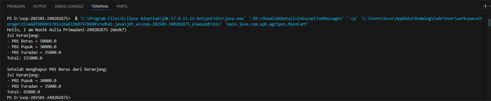

# Laporan Praktikum Minggu 7
Topik: [Collections dan Implementasi Keranjang Belanja"]

## Identitas
- Nama  : [NUNIK AULIA PRIMADANI]
- NIM   : [240202875]
- Kelas : [3IKRB]

---

## Tujuan
- *Menjelaskan konsep collection dalam Java (List, Map, Set).*
- *Menggunakan ArrayList untuk menyimpan dan mengelola objek.*
- *Mengimplementasikan Map atau Set sesuai kebutuhan pengelolaan data.*
- *Melakukan operasi dasar pada collection: tambah, hapus, dan hitung total.*
- *Menganalisis efisiensi penggunaan collection dalam konteks sistem Agri-POS.*

---

## Dasar Teori
1. Java Collections Framework (JCF) Struktur data dinamis yang mampu menyimpan objek tanpa ditentukan ukurannya di awal. Berbeda dengan Array biasa, Collection dapat bertambah dan berkurang secara otomatis.

2. Karakteristik Utama

- ArrayList: Menyimpan data berdasarkan Indeks. Keunggulannya adalah akses cepat secara berurutan, namun lambat untuk pencarian data spesifik.

- HashMap: Menyimpan data berdasarkan Key-Value (Kunci-Nilai). Sangat efektif untuk sistem POS karena satu produk (Key) bisa langsung dihubungkan dengan jumlah belinya (Value).

- HashSet: Koleksi yang menjamin Keunikan. Jika ada data duplikat yang masuk, otomatis akan ditolak.

3. Konsep Generics () Penggunaan tanda kurung sudut (misal: ) memastikan koleksi hanya berisi tipe data yang ditentukan. Hal ini mencegah error saat aplikasi dijalankan (Type Safety).

4. Efisiensi Operasi Dalam keranjang belanja, Map lebih efisien daripada List karena tidak perlu melakukan perulangan (looping) berulang kali hanya untuk memperbarui jumlah (quantity) barang yang sama.

---

## Langkah Praktikum
### 1. Membuat Class Product

```java
package main.java.com.upb.agripos;

public class Product {
 private final String code;
 private final String name;
 private final double price;

 public Product(String code, String name, double price) {
     this.code = code;
     this.name = name;
     this.price = price;
 }

 public String getCode() { return code; }
 public String getName() { return name; }
 public double getPrice() { return price; }
}
```

### 2. Implementasi Keranjang dengan ArrayList

```java
package main.java.com.upb.agripos;

import java.util.ArrayList;

public class ShoppingCart {
 private final ArrayList<Product> items = new ArrayList<>();

 public void addProduct(Product p) { items.add(p); }
 public void removeProduct(Product p) { items.remove(p); }

 public double getTotal() {
     double sum = 0;
     for (Product p : items) {
         sum += p.getPrice();
     }
     return sum;
 }

 public void printCart() {
     System.out.println("Isi Keranjang:");
     for (Product p : items) {
         System.out.println("- " + p.getCode() + " " + p.getName() + " = " + p.getPrice());
     }
     System.out.println("Total: " + getTotal());
 }
}
```

### 3. Main Program (WAJIB DIISI)

```java
package main.java.com.upb.agripos;

public class MainCart {
  public static void main(String[] args) {
      System.out.println("Hello, I am Ismi Nur Fadilah-240202868 (Week7)");

      Product p1 = new Product("P01", "Beras", 50000);
      Product p2 = new Product("P02", "Pupuk", 30000);
      Product p3 = new Product("P02", "Furadan", 35000);

      ShoppingCart cart = new ShoppingCart();
      cart.addProduct(p1);
      cart.addProduct(p2);
      cart.addProduct(p3);
      cart.printCart();

      System.out.println("\nSetelah menghapus " + p1.getCode() + " " + p1.getName() + " dari keranjang:");
      cart.removeProduct(p1);
      cart.printCart();
  }
}
```
### 4. Implementasi Alternatif Menggunakan Map (Dengan Quantity)

```java
package main.java.com.upb.agripos;

import java.util.HashMap;
import java.util.Map;

public class ShoppingCartMap {
 private final Map<Product, Integer> items = new HashMap<>();

 public void addProduct(Product p) { items.put(p, items.getOrDefault(p, 0) + 1); }

 public void removeProduct(Product p) {
     if (!items.containsKey(p)) return;
     int qty = items.get(p);
     if (qty > 1) items.put(p, qty - 1);
     else items.remove(p);
 }

 public double getTotal() {
     double total = 0;
     for (Map.Entry<Product, Integer> entry : items.entrySet()) {
         total += entry.getKey().getPrice() * entry.getValue();
     }
     return total;
 }

 public void printCart() {
     System.out.println("Isi Keranjang (Map):");
     for (Map.Entry<Product, Integer> e : items.entrySet()) {
         System.out.println("- " + e.getKey().getCode() + " " + e.getKey().getName() + " x" + e.getValue());
     }
     System.out.println("Total: " + getTotal());
 }
}
```

### Kode Program

### 1. Product

```java
package main.java.com.upb.agripos;

public class Product {
 private final String code;
 private final String name;
 private final double price;

 public Product(String code, String name, double price) {
     this.code = code;
     this.name = name;
     this.price = price;
 }

 public String getCode() { return code; }
 public String getName() { return name; }
 public double getPrice() { return price; }
}
```
### 2. Shopping Cart

```java
package main.java.com.upb.agripos;

import java.util.ArrayList;

public class ShoppingCart {
 private final ArrayList<Product> items = new ArrayList<>();

 public void addProduct(Product p) { items.add(p); }
 public void removeProduct(Product p) { items.remove(p); }

 public double getTotal() {
     double sum = 0;
     for (Product p : items) {
         sum += p.getPrice();
     }
     return sum;
 }

 public void printCart() {
     System.out.println("Isi Keranjang:");
     for (Product p : items) {
         System.out.println("- " + p.getCode() + " " + p.getName() + " = " + p.getPrice());
     }
     System.out.println("Total: " + getTotal());
 }
}
```

### 3. Shopping Cart Map

```java
package main.java.com.upb.agripos;

import java.util.HashMap;
import java.util.Map;

public class ShoppingCartMap {
 private final Map<Product, Integer> items = new HashMap<>();

 public void addProduct(Product p) { items.put(p, items.getOrDefault(p, 0) + 1); }

 public void removeProduct(Product p) {
     if (!items.containsKey(p)) return;
     int qty = items.get(p);
     if (qty > 1) items.put(p, qty - 1);
     else items.remove(p);
 }

 public double getTotal() {
     double total = 0;
     for (Map.Entry<Product, Integer> entry : items.entrySet()) {
         total += entry.getKey().getPrice() * entry.getValue();
     }
     return total;
 }

 public void printCart() {
     System.out.println("Isi Keranjang (Map):");
     for (Map.Entry<Product, Integer> e : items.entrySet()) {
         System.out.println("- " + e.getKey().getCode() + " " + e.getKey().getName() + " x" + e.getValue());
     }
     System.out.println("Total: " + getTotal());
 }
}
```
### 4. Main Cart

```java
package main.java.com.upb.agripos;

public class MainCart {
  public static void main(String[] args) {
      System.out.println("Hello, I am Ismi Nur Fadilah-240202868 (Week7)");

      Product p1 = new Product("P01", "Beras", 50000);
      Product p2 = new Product("P02", "Pupuk", 30000);
      Product p3 = new Product("P02", "Furadan", 35000);

      ShoppingCart cart = new ShoppingCart();
      cart.addProduct(p1);
      cart.addProduct(p2);
      cart.addProduct(p3);
      cart.printCart();

      System.out.println("\nSetelah menghapus " + p1.getCode() + " " + p1.getName() + " dari keranjang:");
      cart.removeProduct(p1);
      cart.printCart();
  }
}
```
---

## Hasil Eksekusi
  


---

## Analisis
ArrayList cocok untuk keranjang sederhana karena:

- Terurut, mudah iterasi.
- Operasi tambah/hapus sederhana untuk jumlah kecil produk.
Map lebih cocok untuk keranjang kompleks:

- Bisa track quantity setiap produk.
- Akses produk lebih cepat berdasarkan key.
- Set berguna untuk data unik, misal daftar produk yang tidak boleh duplikat.

Praktikum ini mengajarkan penerapan struktur data dalam sistem nyata (POS), sekaligus mempraktikkan object-oriented programming di Java.

---

## Kesimpulan
*Berdasarkan praktikum Week 7, dapat disimpulkan bahwa Java Collections Framework menyediakan struktur data yang fleksibel dan efisien untuk mengelola objek, seperti List, Map, dan Set. ArrayList cocok digunakan untuk keranjang belanja sederhana karena memungkinkan penambahan, penghapusan, dan penampilan elemen secara terurut, sedangkan Map berguna ketika diperlukan tracking quantity atau akses cepat berdasarkan key. Set efektif untuk menyimpan data unik dan mencegah duplikasi. Implementasi keranjang belanja menggunakan ArrayList dan Map memperkuat pemahaman tentang operasi dasar collection, object-oriented programming, dan pemilihan struktur data yang tepat sesuai kebutuhan aplikasi nyata, dalam hal ini sistem Agri-POS.*

---

## Quiz
1. [Jelaskan perbedaan mendasar antara List, Map, dan Set.]  
   **Jawaban:** 
   1. List → Struktur data yang terurut dan dapat menyimpan elemen duplikat. Contoh implementasi: ArrayList.
   2. Map → Struktur data yang menyimpan pasangan key–value, memungkinkan akses cepat berdasarkan key, tapi tidak terurut secara default. Contoh implementasi: HashMap.
   3. Set → Struktur data yang tidak menerima duplikat, sehingga setiap elemen unik, dan tidak mempertahankan urutan. Contoh implementasi: HashSet.

2. [Mengapa ArrayList cocok digunakan untuk keranjang belanja sederhana?]  
   **Jawaban:** ArrayList cocok karena:

- Menyimpan elemen secara terurut sehingga mudah menampilkan isi keranjang.
- Operasi tambah, hapus, dan iterasi sederhana dan cepat untuk jumlah item yang tidak terlalu besar.
- Tidak perlu tracking quantity produk secara kompleks, cukup menambahkan atau menghapus objek produk langsung.

3. [Bagaimana struktur Set mencegah duplikasi data?]  
   **Jawaban:** Set secara otomatis menolak elemen yang sudah ada di dalamnya. Saat kita menambahkan elemen yang sama, Set tidak akan menambahkannya, sehingga setiap item tetap unik tanpa perlu pengecekan manual.

4. [Kapan sebaiknya menggunakan Map dibandingkan List? Jelaskan dengan contoh.]
   **Jawaban:** Map sebaiknya digunakan ketika ingin mengakses data berdasarkan key atau melacak quantity setiap item dengan cepat. Contoh: Keranjang belanja yang perlu menghitung jumlah setiap produk. Misal Map<Product, Integer>: menambahkan produk yang sama akan meningkatkan quantity, bukan membuat entry duplikat, sehingga lebih efisien dibanding List.