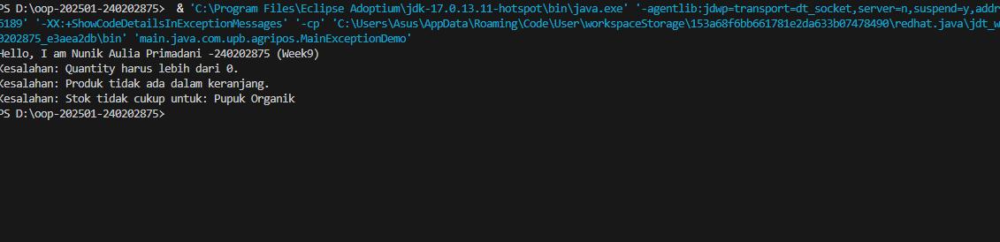

# Laporan Praktikum Minggu 9
Topik: ["Exception Handling, Custom Exception, dan Penerapan Design Pattern"]

## Identitas
- Nama  : [NUNIK AULIA PRIMADANI]
- NIM   : [240202875]
- Kelas : [3IKRB]

---

## Tujuan
- *Mahasiswa Mampu menjelaskan perbedaan antara error dan exception.*
- *Mahasiswa Mampu mengimplementasikan try–catch–finally dengan tepat.*
- *Mahasiswa Mampu  membuat custom exception sesuai kebutuhan program.
Mengintegrasikan exception handling ke dalam aplikasi sederhana (kasus keranjang belanja).*
- *Mahasiswa Mampu (Opsional) Menerapkan design pattern sederhana (Singleton/MVC) dan unit testing dasar.*

---

## Dasar Teori

### 1. Error vs Exception
- Error → kondisi fatal, tidak dapat ditangani (contoh: OutOfMemoryError).
- Exception → kondisi tidak normal yang dapat ditangani oleh program.

### 2. Struktur try–catch–finally

```java
try {
    // kode yang berpotensi menimbulkan kesalahan
} catch (Exception e) {
    // penanganan
} finally {
    // blok yang selalu dijalankan
}
```

### 3. Membuat Custom Exception

```java
package com.upb.agripos;

public class InvalidQuantityException extends Exception {
   public InvalidQuantityException(String message) {
       super(message);
   }
}
```
---

## Langkah Praktikum
1. Membuat struktur folder dan package sesuai standar Java.
2. Membuat beberapa custom exception untuk validasi logika bisnis.
3. Membuat class Product sebagai model data.
4. Mengimplementasikan class ShoppingCart untuk proses transaksi.
5. Menggunakan try–catch pada class utama untuk menangani exception.

---

## Kode Program

### 1.InsufficientStockException.java

```java
package main.java.com.upb.agripos;

public class InsufficientStockException extends Exception {
    public InsufficientStockException(String msg) { 
        super(msg); 
    }
}
```
### 2. Product.java

```java
package main.java.com.upb.agripos;

public class Produk {
    private final String code;
    private final String name;
    private final double price;
    private int stock;

    public Produk(String code, String name, double price, int stock) {
        this.code = code;
        this.name = name;
        this.price = price;
        this.stock = stock;
    }

    public String getCode() { return code; }
    public String getName() { return name; }
    public double getPrice() { return price; }
    public int getStock() { return stock; }
    public void reduceStock(int qty) { this.stock -= qty; }
}
```

### 3. ShoppingCart.java

```java
package main.java.com.upb.agripos;
import java.util.ArrayList;

import main.java.com.upb.agripos.InvalidQuantityException;

public class ShoppingCart {
    private final ArrayList<Produk> items = new ArrayList<>();

    public void addProduct(Produk p, int qty) throws InvalidQuantityException {
    if (qty <= 0) {
        throw new InvalidQuantityException("Quantity harus lebih dari 0.");
    }
    for (int i = 0; i < qty; i++) {
        items.add(p);
    }
    }

    public void removeProduct(Produk p) throws ProductNotFoundException {
        // Pesan disesuaikan dengan gambar Anda
        if (!items.contains(p)) throw new ProductNotFoundException("Produk tidak ada dalam keranjang.");
        items.remove(p);
    }

    public void checkout() throws InsufficientStockException {
        for (Produk p : items) {
            // Jika jumlah di keranjang melebihi stok yang ada
            if (p.getStock() < 1) { 
                throw new InsufficientStockException("Stok tidak cukup untuk: " + p.getName());
            }
        }
        System.out.println("Checkout Berhasil!");
        items.clear();
    }

    public void printCart() {
        // TODO Auto-generated method stub
        throw new UnsupportedOperationException("Unimplemented method 'printCart'");
    }
}
```

### 4. MainExceptionDemo.java

```java
package main.java.com.upb.agripos;

import main.java.com.upb.agripos.InvalidQuantityException;

public class MainExceptionDemo {
    public static void main(String[] args) {
        System.out.println("Hello, I am Nunik Aulia Primadani -240202875 (Week9)");

        ShoppingCart cart = new ShoppingCart();
        Produk p1 = new Produk("P01", "Pupuk Organik", 25000, 3);

        // 1. Trigger: Quantity harus lebih dari 0.
        try {
            cart.addProduct(p1, -1);
        } catch (InvalidQuantityException e) {
            System.out.println("Kesalahan: " + e.getMessage());
        }

        // 2. Trigger: Produk tidak ada dalam keranjang.
        try {
            cart.removeProduct(p1);
        } catch (ProductNotFoundException e) {
            System.out.println("Kesalahan: " + e.getMessage());
        }

        // 3. Trigger: Stok tidak cukup untuk: Pupuk Organik
        try {
            // Kita set stok jadi 0 dulu untuk simulasi error sesuai gambar
            p1.reduceStock(3); 
            cart.addProduct(p1, 1);
            cart.checkout();
        } catch (InsufficientStockException e) {
            System.out.println("Kesalahan: " + e.getMessage());
        } catch (Exception e) {
            System.out.println("Kesalahan: " + e.getMessage());
        }
    }
}
```

---

## Hasil Eksekusi 


---

## Analisis
(
- Jelaskan bagaimana kode berjalan.  
 **Jawaban:**  Program menggunakan collection (List/Map) untuk menyimpan data produk di dalam keranjang belanja. Saat produk ditambahkan, sistem menyimpan objek produk beserta jumlahnya ke dalam keranjang, lalu menghitung total harga berdasarkan isi koleksi tersebut. Operasi seperti tambah, hapus, dan menampilkan isi keranjang dilakukan dengan mengakses dan memanipulasi koleksi.
- Apa perbedaan pendekatan minggu ini dibanding minggu sebelumnya.  
 **Jawaban:** Minggu ini fokus pada pengelolaan data dinamis menggunakan collection (seperti List atau Map) untuk menampung banyak objek dalam satu struktur, khususnya pada fitur keranjang belanja.
- Kendala yang dihadapi dan cara mengatasinya.  
 **Jawaban:** -
)
---

## Kesimpulan
 *Pada praktikum ini, konsep exception handling digunakan untuk menangani kesalahan yang dapat terjadi saat program berjalan, seperti input tidak valid atau operasi yang tidak diperbolehkan. Dengan menggunakan try, catch, dan throw, program menjadi lebih aman karena tidak langsung berhenti ketika terjadi error. Penerapan exception handling membuat sistem lebih stabil, mudah dikontrol, dan meningkatkan kualitas program dalam menangani kondisi tidak normal*

---

## Quiz
1. [Jelaskan perbedaan error dan exception]  
   **Jawaban:**  Error adalah kesalahan serius yang terjadi di luar kendali program dan biasanya tidak dapat ditangani, seperti masalah memori.Exception adalah kesalahan yang masih bisa ditangani oleh program, misalnya input tidak valid atau data tidak ditemukan.

2. [Apa fungsi finally dalam blok try–catch–finally?]  
   **Jawaban:** Blok finally digunakan untuk mengeksekusi kode yang pasti dijalankan, baik terjadi exception maupun tidak, seperti menutup resource atau menampilkan pesan akhir

3. [Mengapa custom exception diperlukan? ]  
   **Jawaban:** Custom exception diperlukan agar kesalahan yang terjadi lebih spesifik dan mudah dipahami, sesuai dengan aturan bisnis aplikasi, sehingga penanganan error menjadi lebih jelas dan terstruktur. 

4. [Berikan contoh kasus bisnis dalam POS yang membutuhkan custom exception.]
   **Jawaban:** Contohnya adalah StokTidakCukupException, yang muncul ketika kasir mencoba menjual produk dengan jumlah melebihi stok yang tersedia di sistem POS